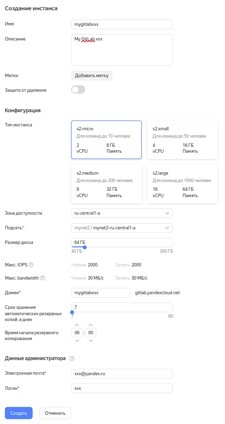
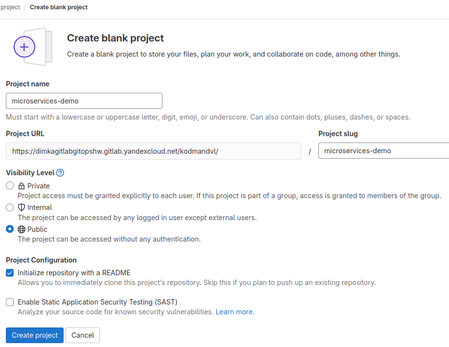
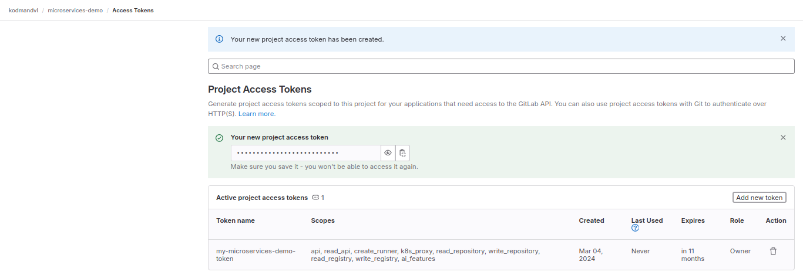

# Подготовка

```
mkdir -p kubernetes-gitops && cd kubernetes-gitops/
cp -aiv ../README.md ./
```

## Создание кластера

Создание кластера выполнялось с помощью terraform (см. terraform_and_yc/README.md). 

Нужно в файлы terraform_and_yc/README.md и в terraform_and_yc/locals.tf подставить свои актуальные значения: 

- cloud-id
- folder-id
- my.ip.ad.dr (IP для подключения к куберу, например, мой домашний статический IP-адрес от провайдера, какая-то подсеть или просто для всех адресов 0.0.0.0/0)
- my-admin-sa (сервисный аккаунт, который создается для дальнейших мероприятий)
- my-admin-sa-id (его ID)
- my-cluster-sa (это сервисный акаунт, который будет создан сервисным аккаунтом my-admin-sa уже для кластера Kubernetes)
- и другие, при необходимости (например, k8s_version, zone и т.д.)

После чего выполнить соответствующие мероприятия по подготовке сущностей и managed кластера Kubernetes. 

Terraform позволяет создать нашу инфраструктуру декларативно и идемпотентно: 

```text
$ terraform apply
..........
Plan: 11 to add, 0 to change, 0 to destroy.

Do you want to perform these actions?
  Terraform will perform the actions described above.
  Only 'yes' will be accepted to approve.

  Enter a value: yes

yandex_iam_service_account.myaccount: Creating...
yandex_kms_symmetric_key.kms-key: Creating...
yandex_vpc_network.mynet: Creating...
..........
yandex_kubernetes_cluster.my-k8s-cluster: Creating...
yandex_kubernetes_cluster.my-k8s-cluster: Still creating... [10s elapsed]
yandex_kubernetes_cluster.my-k8s-cluster: Still creating... [20s elapsed]
..........
yandex_kubernetes_cluster.my-k8s-cluster: Still creating... [7m10s elapsed]
yandex_kubernetes_cluster.my-k8s-cluster: Creation complete after 7m16s [id=..........]
null_resource.kubectl: Creating...
null_resource.kubectl: Provisioning with 'local-exec'...
..........
yandex_kubernetes_node_group.my-k8s-node-group: Creating...
..........
yandex_kubernetes_node_group.my-k8s-node-group: Creation complete after 1m43s [id=..........]

Apply complete! Resources: 11 added, 0 changed, 0 destroyed.
```

Группа узлов создана по условию задания: 

Понадобится как минимум 4 ноды типа intel ice lake, 2vCPU, 8 GB RAM: 

```text
..........
  instance_template {
    platform_id = "standard-v3"
..........
    resources {
      memory = 8
      cores  = 2
    }
..........
  scale_policy {
    fixed_scale {
      size = 4
    }
  }
..........
```

Повторный прогон того же плана ничего не изменит, если у кластера и других созданных сущностей ничего не изменилось: 

```text
$ terraform apply
yandex_iam_service_account.myaccount: Refreshing state... [id=..........]
yandex_vpc_network.mynet: Refreshing state... [id=..........]
yandex_kms_symmetric_key.kms-key: Refreshing state... [id=..........]
yandex_resourcemanager_folder_iam_member.admin: Refreshing state... [id=........../admin/serviceAccount:..........]
yandex_vpc_subnet.mysubnet: Refreshing state... [id=..........]
yandex_vpc_security_group.k8s-nodes-ssh-access: Refreshing state... [id=..........]
yandex_vpc_security_group.k8s-master-whitelist: Refreshing state... [id=..........]
yandex_vpc_security_group.k8s-public-services: Refreshing state... [id=..........]
yandex_kubernetes_cluster.my-k8s-cluster: Refreshing state... [id=..........]
null_resource.kubectl: Refreshing state... [id=..........]
yandex_kubernetes_node_group.my-k8s-node-group: Refreshing state... [id=..........]

No changes. Your infrastructure matches the configuration.

Terraform has compared your real infrastructure against your configuration and found no differences, so no changes are needed.

Apply complete! Resources: 0 added, 0 changed, 0 destroyed.
```

Затем я решил подправить `allowed_ips` в `locals.tf`, чтобы доступ был разрешен не только с моего IP, но и с других, например, для всех адресов (в учебных целях): 

```text
  allowed_ips = ["0.0.0.0/0"]
```

В этом случае не нужно будет пересоздавать кластер, а просто привести его в соответствие с новым планом:

```text
$ terraform plan
yandex_kms_symmetric_key.kms-key: Refreshing state... [id=..........]
yandex_iam_service_account.myaccount: Refreshing state... [id=..........]
..........
Plan: 0 to add, 2 to change, 0 to destroy.
..........
$ terraform apply
yandex_iam_service_account.myaccount: Refreshing state... [id=..........]
yandex_kms_symmetric_key.kms-key: Refreshing state... [id=..........]
..........
Plan: 0 to add, 2 to change, 0 to destroy.

Do you want to perform these actions?
  Terraform will perform the actions described above.
  Only 'yes' will be accepted to approve.

  Enter a value: yes

yandex_vpc_security_group.k8s-nodes-ssh-access: Modifying... [id=..........]
yandex_vpc_security_group.k8s-master-whitelist: Modifying... [id=..........]
yandex_vpc_security_group.k8s-nodes-ssh-access: Modifications complete after 3s [id=..........]
yandex_vpc_security_group.k8s-master-whitelist: Modifications complete after 3s [id=..........]

Apply complete! Resources: 0 added, 2 changed, 0 destroyed.
```

А с помощью команды `terraform destroy` можно, наоборот, удалить все сущности, созданные ранее в рамках плана командой `terraform apply`, что очень удобно. 

В рамках ДЗ по GitOps как раз решил разобраться, наконец, именно с Terraform-ом, а не использовать свои Bash-скрипты-обёртки для утилиты yc. 

## Посмотреть:

```bash
kubectl get nodes -o wide
kubectl cluster-info
```

```text
$ kubectl get nodes -o wide
NAME                        STATUS   ROLES    AGE     VERSION   INTERNAL-IP   EXTERNAL-IP       OS-IMAGE             KERNEL-VERSION      CONTAINER-RUNTIME
cl1reqgcsg7dpd50mjek-acyj   Ready    <none>   9m46s   v1.28.2   10.1.0.21     158.160.107.153   Ubuntu 20.04.6 LTS   5.4.0-167-generic   containerd://1.6.22
cl1reqgcsg7dpd50mjek-ahan   Ready    <none>   9m41s   v1.28.2   10.1.0.29     158.160.118.67    Ubuntu 20.04.6 LTS   5.4.0-167-generic   containerd://1.6.22
cl1reqgcsg7dpd50mjek-ahet   Ready    <none>   9m52s   v1.28.2   10.1.0.7      158.160.118.158   Ubuntu 20.04.6 LTS   5.4.0-167-generic   containerd://1.6.22
cl1reqgcsg7dpd50mjek-azid   Ready    <none>   9m46s   v1.28.2   10.1.0.6      51.250.84.75      Ubuntu 20.04.6 LTS   5.4.0-167-generic   containerd://1.6.22
$ kubectl cluster-info
Kubernetes control plane is running at https://158.160.124.164
CoreDNS is running at https://158.160.124.164/api/v1/namespaces/kube-system/services/kube-dns:dns/proxy

To further debug and diagnose cluster problems, use 'kubectl cluster-info dump'.
```

## GitLab

В качестве GitLab взял [Managed Service fot GitLab от Yandex Cloud](https://cloud.yandex.ru/ru/docs/managed-gitlab/quickstart): 

 

(где xxx - мой логин, какой-то уникальный идентификатор или т.п.) 

Когда наш ресурс `Managed Service for GitLab` после создания перейдет в статус `Running`, нам нужно будет его [активировать и настроить для работы](https://cloud.yandex.ru/ru/docs/managed-gitlab/quickstart#configure-mgl). 

В итоге имеем свой GitLab по адресу https://dimkagitlabgitopshw.gitlab.yandexcloud.net/ 

Создал, помимо административной учётки GitLab, свою прикладную учётку (kodmandvl), дал для этой учётки права администратора и добавил публичный SSH-ключ. 

После этого создайте в GitLab публичный проект microservices-demo: 

 

Проверим подключение к GitLab и склонируем наш пустой репозиторий: 

```text
$ ssh -T git@dimkagitlabgitopshw.gitlab.yandexcloud.net
Warning: Permanently added 'dimkagitlabgitopshw.gitlab.yandexcloud.net' (ED25519) to the list of known hosts.
Welcome to GitLab, @kodmandvl!
$ git clone git@dimkagitlabgitopshw.gitlab.yandexcloud.net:kodmandvl/microservices-demo.git
Клонирование в «microservices-demo»...
remote: Enumerating objects: 3, done.
remote: Counting objects: 100% (3/3), done.
remote: Compressing objects: 100% (2/2), done.
remote: Total 3 (delta 0), reused 0 (delta 0), pack-reused 0
Получение объектов: 100% (3/3), готово.
```

Теперь переместим в [наш проект](https://dimkagitlabgitopshw.gitlab.yandexcloud.net/kodmandvl/microservices-demo) код из [GitHub репозитория microservices-demo](https://github.com/GoogleCloudPlatform/microservices-demo). 

## Создание Helm чартов

- Перед началом выполнения домашнего задания необходимо подготовить Helm чарты для каждого микросервиса
- Можно воспользоваться наработками из предыдущих домашних заданий либо скопировать готовые чарты из [демонстрационного репозитория](https://gitlab.com/express42/kubernetes-platform-demo/microservices-demo/) (директория `deploy/charts`)
- Во всех манифестах, описывающих deployment, обязательно должны быть параметризованы название образа и его тег. Рекомендуется придерживаться следующего формата:

```text
image:
  repository: kodmandvl/frontend
  tag: latest
```

Разместил в https://dimkagitlabgitopshw.gitlab.yandexcloud.net/kodmandvl/microservices-demo/-/tree/main/deploy/charts 

```text
$ export GITLAB_REPO=/path/to/gitlab/repo/microservices-demo
$ cd $GITLAB_REPO
$ tree -L 1 deploy/charts
deploy/charts
├── adservice
├── cartservice
├── checkoutservice
├── currencyservice
├── emailservice
├── frontend
├── loadgenerator
├── paymentservice
├── productcatalogservice
├── recommendationservice
└── shippingservice

11 directories, 0 files
```

## Continuous Integration

- Соберите Docker образы для всех микросервисов и поместите данные образы в Docker Hub
- При тегировании образов используйте подход semver, например, первому собранному образу логично выставить тег v0.0.1
- После выполнения данного шага в Docker Hub должно находиться как минимум по одному образу для каждого микросервиса

Набросал такой bash-скриптик: 

```bash
docker login
export GITLAB_REPO=/path/to/gitlab/repo/microservices-demo
for dir in \
adservice \
cartservice \
checkoutservice \
currencyservice \
emailservice \
frontend \
loadgenerator \
paymentservice \
productcatalogservice \
recommendationservice \
shippingservice \
# end of list #
do
echo
echo "##### Build and push ${dir} image: #####"
cd ${GITLAB_REPO}/src/${dir} && docker build -t kodmandvl/${dir}:v0.0.1 . && docker push kodmandvl/${dir}:v0.0.1 && docker tag kodmandvl/${dir}:v0.0.1 kodmandvl/${dir}:latest && docker push kodmandvl/${dir}:latest && echo "${dir} image has been successfully builded and pushed." && sleep 1 && echo && echo "########## ${dir}: OK ##########"
done
echo
echo Done.
echo
docker images | grep v0.0.1 | sort
docker images | grep latest | sort
```

Для 9 из 11 микросервисов образы создались и выложились на DockerHub с первого раза, а при сборке cartservice и paymentservice были ошибки. Повторная попытка для paymentservice была успешной, а вот cartservice - нет: Dockerfile там находится не в директории cartservice, а в cartservice/src (пересобрал после замены в скриптике `${GITLAB_REPO}/src/${dir}` на `${GITLAB_REPO}/src/${dir}/src`). 

Теперь: 

```text
$ docker images | grep v0.0.1 | sort
kodmandvl/adservice                                  v0.0.1               83d61c893cd9   46 minutes ago   263MB
kodmandvl/cartservice                                v0.0.1               4ebd298b11df   2 minutes ago    109MB
kodmandvl/checkoutservice                            v0.0.1               614f7f9cb94c   28 minutes ago   29.1MB
kodmandvl/currencyservice                            v0.0.1               947c62107aae   26 minutes ago   251MB
kodmandvl/emailservice                               v0.0.1               2d96505684e1   25 minutes ago   298MB
kodmandvl/frontend                                   v0.0.1               71169dca3176   24 minutes ago   42.2MB
kodmandvl/loadgenerator                              v0.0.1               4452e6c150d1   23 minutes ago   198MB
kodmandvl/paymentservice                             v0.0.1               f8c65132a1d7   12 minutes ago   243MB
kodmandvl/productcatalogservice                      v0.0.1               f35c92a5ddba   22 minutes ago   29.2MB
kodmandvl/recommendationservice                      v0.0.1               0eda2bf53923   20 minutes ago   296MB
kodmandvl/shippingservice                            v0.0.1               9c835a44eb74   19 minutes ago   28.2MB
```

# GitOps

## Подготовка

- Установим flux

```bash
wget https://fluxcd.io/install.sh
less install.sh
curl -s https://fluxcd.io/install.sh | sudo bash
```

```text
$ flux --version
flux version 2.2.3
$ flux --help

Command line utility for assembling Kubernetes CD pipelines the GitOps way.
..........
$ flux bootstrap --help
The bootstrap sub-commands push the Flux manifests to a Git repository
and deploy Flux on the cluster.

Usage:
  flux bootstrap [command]

Available Commands:
  bitbucket-server Deploy Flux on a cluster connected to a Bitbucket Server repository
  git              Deploy Flux on a cluster connected to a Git repository
  gitea            Deploy Flux on a cluster connected to a Gitea repository
  github           Deploy Flux on a cluster connected to a GitHub repository
  gitlab           Deploy Flux on a cluster connected to a GitLab repository
..........
$ flux bootstrap gitlab --help
The bootstrap gitlab command creates the GitLab repository if it doesn't exists and
commits the Flux manifests to the specified branch.
Then it configures the target cluster to synchronize with that repository.
If the Flux components are present on the cluster,
the bootstrap command will perform an upgrade if needed.

Usage:
  flux bootstrap gitlab [flags]

Examples:
  # Create a GitLab API token and export it as an env var
  export GITLAB_TOKEN=<my-token>
..........
```

- Добавим Gitlab bootstrap

Создадим Project Access Token: 

 

Затем: 

```bash
export GITLAB_TOKEN=token
export GITLAB_USER=kodmandvl
flux bootstrap gitlab \
  --hostname=https://dimkagitlabgitopshw.gitlab.yandexcloud.net \
  --owner=$GITLAB_USER \
  --repository=microservices-demo \
  --branch=main \
  --path=clusters/yc-managed-k8s-catlt88rdjgbugt3idu5 \
  --token-auth \
  --components-extra=image-reflector-controller,image-automation-controller
```

```text
$ flux bootstrap gitlab \
  --hostname=https://dimkagitlabgitopshw.gitlab.yandexcloud.net \
  --owner=$GITLAB_USER \
  --repository=microservices-demo \
  --branch=main \
  --path=clusters/yc-managed-k8s-catlt88rdjgbugt3idu5 \
  --token-auth \
  --components-extra=image-reflector-controller,image-automation-controller
► connecting to https://dimkagitlabgitopshw.gitlab.yandexcloud.net
► cloning branch "main" from Git repository "https://dimkagitlabgitopshw.gitlab.yandexcloud.net/kodmandvl/microservices-demo.git"
✔ cloned repository
► generating component manifests
✔ generated component manifests
✔ committed component manifests to "main" ("469a9ae31f34d86fc06c595c9d63be94c8f861a8")
► pushing component manifests to "https://dimkagitlabgitopshw.gitlab.yandexcloud.net/kodmandvl/microservices-demo.git"
► installing components in "flux-system" namespace
✔ installed components
✔ reconciled components
► determining if source secret "flux-system/flux-system" exists
► generating source secret
► applying source secret "flux-system/flux-system"
✔ reconciled source secret
► generating sync manifests
✔ generated sync manifests
✔ committed sync manifests to "main" ("b1c777d7b993866e383575d21acf1e51bca3a12b")
► pushing sync manifests to "https://dimkagitlabgitopshw.gitlab.yandexcloud.net/kodmandvl/microservices-demo.git"
► applying sync manifests
✔ reconciled sync configuration
◎ waiting for GitRepository "flux-system/flux-system" to be reconciled
✔ GitRepository reconciled successfully
◎ waiting for Kustomization "flux-system/flux-system" to be reconciled
✔ Kustomization reconciled successfully
► confirming components are healthy
✔ helm-controller: deployment ready
✔ image-automation-controller: deployment ready
✔ image-reflector-controller: deployment ready
✔ kustomize-controller: deployment ready
✔ notification-controller: deployment ready
✔ source-controller: deployment ready
✔ all components are healthy
```

```text
$ flux get all
NAME                     	REVISION          	SUSPENDED	READY	MESSAGE                                           
gitrepository/flux-system	main@sha1:b1c777d7	False    	True 	stored artifact for revision 'main@sha1:b1c777d7'	

NAME                     	REVISION          	SUSPENDED	READY	MESSAGE                              
kustomization/flux-system	main@sha1:b1c777d7	False    	True 	Applied revision: main@sha1:b1c777d7	
```

Видим изменения в нашем GitLab-проекте: 

```bash
cd $GITLAB_REPO
git pull
git status
tree -L 1 clusters/yc-managed-k8s-catlt88rdjgbugt3idu5/flux-system/
```

```text
$ tree -L 1 clusters/yc-managed-k8s-catlt88rdjgbugt3idu5/flux-system/
clusters/yc-managed-k8s-catlt88rdjgbugt3idu5/flux-system/
├── gotk-components.yaml
├── gotk-sync.yaml
└── kustomization.yaml

0 directories, 3 files
```

## Проверка

```bash
cd $GITLAB_REPO
cd clusters/yc-managed-k8s-catlt88rdjgbugt3idu5/
mkdir -p deploy/namespaces/
cd deploy/namespaces/
echo 'apiVersion: v1
kind: Namespace
metadata:
  name: microservices-demo
' > ./microservices-demo.yaml
cat microservices-demo.yaml 
k get ns | grep micro
# Пушим в наш GitLab:
cd $GITLAB_REPO
git status && git add -A && git status && git commit -am microservices-demo_namespace && git push && git status
# Через некоторое время:
k get ns | grep micro
```

```text
k get ns | grep micro
microservices-demo   Active   37s
```

## HelmRelease

Мы подобрались к сущностям, которыми управляет helm-operator - HelmRelease. 

Для описания сущностей такого вида создадим отдельную директорию deploy/releases и поместим туда файл frontend.yaml с описанием конфигурации релиза. 

```text
$ cd $GITLAB_REPO
$ mkdir -p clusters/yc-managed-k8s-catlt88rdjgbugt3idu5/deploy/releases
$ cd clusters/yc-managed-k8s-catlt88rdjgbugt3idu5/deploy/releases
$ nano frontend.yaml
$ cat frontend.yaml 
apiVersion: helm.fluxcd.io/v1
kind: HelmRelease
metadata:
  name: frontend
  namespace: microservices-demo
  annotations:
    fluxcd.io/ignore: "false"
    fluxcd.io/automated: "true"
    flux.weave.works/tag.chart-image: semver:~v0.0
spec:
  releaseName: frontend
  helmVersion: v3
  chart:
    git: git@dimkagitlabgitopshw.gitlab.yandexcloud.net:kodmandvl/microservices-demo.git
    ref: main
    path: deploy/charts/frontend
values:
  image:
    repository: kodmandvl/frontend
    tag: v0.0.1
$ cd $GITLAB_REPO
$ git status && git add -A && git status && git commit -am frontend_release && git push && git status
На ветке main
Ваша ветка обновлена в соответствии с «origin/main».
..........
 2 files changed, 20 insertions(+), 4 deletions(-)
 create mode 100644 clusters/yc-managed-k8s-catlt88rdjgbugt3idu5/deploy/releases/frontend.yaml
 delete mode 100644 deploy/namespaces/microservices-demo.yaml
..........
```

## HelmRelease | Проверка

Убедимся что HelmRelease для микросервиса frontend появился в кластере: 

не появился 

Нашел такую ошибку в `flux events`: 

```text
$ flux events
LAST SEEN           	TYPE   	REASON                 	OBJECT                   	MESSAGE                                                                                                                                                                                                             
..........
42m                 	Normal 	Progressing            	Kustomization/flux-system	Namespace/microservices-demo created                                                                                                                                                                               	
..........
11s (x6 over 23m)   	Warning	ReconciliationFailed   	Kustomization/flux-system	HelmRelease/microservices-demo/frontend dry-run failed: failed to get API group resources: unable to retrieve the complete list of server APIs: helm.fluxcd.io/v1: the server could not find the requested resource	
```

Насколько я понимаю, связанао с тем, что в методических указаниях дан пример для flux v1, но при этом скрипт установки для flux v2. 

На основе [вот этих примеров](https://github.com/fluxcd/flux2-kustomize-helm-example) и [документации](https://fluxcd.io/flux/guides/helmreleases/#git-repository) получил такой frontend.yaml для flux v2. 


Сам наш GitRepository уже существует как сущность в кубере (применять отдельный манифест с `Kind: GitRepository` не будем): 

```text
$ kubectl get gitrepositories.source.toolkit.fluxcd.io -n flux-system
NAME          URL                                                                                   AGE    READY   STATUS
flux-system   https://dimkagitlabgitopshw.gitlab.yandexcloud.net/kodmandvl/microservices-demo.git   140m   True    stored artifact for revision 'main@sha1:938d03ec3f09c83224cc82af6c412179f511cebf'
```

Тогда изменённый frontend.yaml для Flux V2 (не только неймспейс flux-system, но и наш репозиторий нащывается flux-system): 

```yaml
apiVersion: helm.toolkit.fluxcd.io/v2beta2
kind: HelmRelease
metadata:
  name: frontend
  namespace: microservices-demo
  annotations:
    fluxcd.io/ignore: "false"
    fluxcd.io/automated: "true"
    flux.weave.works/tag.chart-image: semver:~v0.0
spec:
  interval: 5m
  chart:
    spec:
      chart: deploy/charts/frontend
      sourceRef:
        kind: GitRepository
        name: flux-system
        namespace: flux-system
      interval: 1m
  values:
    image:
      repository: docker.io/kodmandvl/frontend
      tag: v0.0.1
```

Теперь: 

```text
$ flux events
LAST SEEN            	TYPE   	REASON                    	OBJECT                               	MESSAGE                                                                                                ..........
67s                  	Normal 	ChartPackageSucceeded     	HelmChart/microservices-demo-frontend	packaged 'frontend' chart with version '0.21.0'
7s                   	Normal 	ArtifactUpToDate          	HelmChart/microservices-demo-frontend	artifact up-to-date with remote revision: '0.21.0'
..........
```

Релиз Helm-ом на самом деле не установился. Дальше по тексту методических указаний как раз будет устанавливаться Istio, но сейчас пока без него и без зависимостей всё не совсем так, как хотелось бы, и не так, как в методических указаниях... 

Сделал еще для paymentservice.yaml и currencyservice.yaml (там тоже синаксически всё верно и ставится, но с ошибками). 

# Canary deployments с Flagger и Istio

## Flagger

Flagger - оператор Kubernetes, созданный для автоматизации canary deployments. 

Flagger может использовать: 

- Istio, Linkerd, App Mesh или nginx для маршрутизации трафика
- Prometheus для анализа канареечного релиза

## Установка Istio

Установим Istio в кластер с помощью istioctl: 

- [Документация по установке](https://istio.io/latest/docs/setup/install/istioctl/)
- [Шаги установки](https://istio.io/latest/docs/setup/getting-started/)
- [Подробнее про configuration profile](https://istio.io/latest/docs/setup/additional-setup/config-profiles/)
- [документация по установке Istio с использованием Helm](https://istio.io/latest/docs/setup/install/helm/)

```bash
wget https://istio.io/downloadIstio
mv downloadIstio istio_install.sh
curl -L https://istio.io/downloadIstio | sh -
# Move to the Istio package directory. For example, if the package is istio-1.20.3:
cd istio-1.20.3
# The installation directory contains:
# Sample applications in samples/
# The istioctl client binary in the bin/ directory.
# Add the istioctl client to your path (Linux or macOS):
# export PATH=$PWD/bin:$PATH
# Установим в /usr/local/bin, как и остальные инстурменты для Kubernetes:
cd bin/
sudo install -o root -g root -m 0755 istioctl /usr/local/bin/istioctl
```

```text
$ curl -L https://istio.io/downloadIstio | sh -
  % Total    % Received % Xferd  Average Speed   Time    Time     Time  Current
                                 Dload  Upload   Total   Spent    Left  Speed
100   101  100   101    0     0    469      0 --:--:-- --:--:-- --:--:--   469
100  4899  100  4899    0     0  15073      0 --:--:-- --:--:-- --:--:-- 15073

Downloading istio-1.20.3 from https://github.com/istio/istio/releases/download/1.20.3/istio-1.20.3-linux-amd64.tar.gz ...

Istio 1.20.3 Download Complete!

Istio has been successfully downloaded into the istio-1.20.3 folder on your system.

Next Steps:
See https://istio.io/latest/docs/setup/install/ to add Istio to your Kubernetes cluster.

To configure the istioctl client tool for your workstation,
add the /home/dimka/temp/gitopshw/istio/istio-1.20.3/bin directory to your environment path variable with:
	 export PATH="$PATH:/home/dimka/temp/gitopshw/istio/istio-1.20.3/bin"

Begin the Istio pre-installation check by running:
	 istioctl x precheck 

Need more information? Visit https://istio.io/latest/docs/setup/install/ 
```

[В профиль demo входят компоненты istio-egressgateway, istio-ingressgateway	и istiod](https://istio.io/latest/docs/setup/additional-setup/config-profiles/). 

Установка: 

```bash
istioctl manifest apply --set profile=demo
```

```text
$ istioctl manifest apply --set profile=demo
This will install the Istio 1.20.3 "demo" profile (with components: Istio core, Istiod, Ingress gateways, and Egress gateways) into the cluster. Proceed? (y/N) y
✔ Istio core installed                                                                                                
✔ Istiod installed                                                                                                    
✔ Egress gateways installed                                                                                           
✔ Ingress gateways installed                                                                                          
✔ Installation complete                                                                                               Made this installation the default for injection and validation.
$ k get all -n istio-system
NAME                                        READY   STATUS    RESTARTS   AGE
pod/istio-egressgateway-c878fd6c5-q86lc     1/1     Running   0          7m26s
pod/istio-ingressgateway-86446666f9-7gx85   1/1     Running   0          7m26s
pod/istiod-75d8d56b68-2f48f                 1/1     Running   0          7m36s

NAME                           TYPE           CLUSTER-IP      EXTERNAL-IP       PORT(S)                                                                      AGE
service/istio-egressgateway    ClusterIP      10.96.226.202   <none>            80/TCP,443/TCP                                                               7m26s
service/istio-ingressgateway   LoadBalancer   10.96.172.237   158.160.147.110   15021:31005/TCP,80:31999/TCP,443:32597/TCP,31400:30589/TCP,15443:32392/TCP   7m26s
service/istiod                 ClusterIP      10.96.162.19    <none>            15010/TCP,15012/TCP,443/TCP,15014/TCP                                        7m36s

NAME                                   READY   UP-TO-DATE   AVAILABLE   AGE
deployment.apps/istio-egressgateway    1/1     1            1           7m26s
deployment.apps/istio-ingressgateway   1/1     1            1           7m26s
deployment.apps/istiod                 1/1     1            1           7m36s

NAME                                              DESIRED   CURRENT   READY   AGE
replicaset.apps/istio-egressgateway-c878fd6c5     1         1         1       7m26s
replicaset.apps/istio-ingressgateway-86446666f9   1         1         1       7m26s
replicaset.apps/istiod-75d8d56b68                 1         1         1       7m36s
```

## Установка Flagger

1. Добавление helm-репозитория flagger:

```bash
helm repo add flagger https://flagger.app
```

1. Установка CRD для Flagger:

```bash
kubectl apply -f https://raw.githubusercontent.com/weaveworks/flagger/master/artifacts/flagger/crd.yaml
```

3. Установка flagger с указанием использовать Istio:

```bash
helm upgrade --install flagger flagger/flagger \
--namespace=istio-system \
--set crd.create=false \
--set meshProvider=istio \
--set metricsServer=http://prometheus.monitoring.svc.cluster.local:9090
```

```text
$ helm repo add flagger https://flagger.app
"flagger" has been added to your repositories
$ kubectl apply -f https://raw.githubusercontent.com/weaveworks/flagger/master/artifacts/flagger/crd.yaml
customresourcedefinition.apiextensions.k8s.io/canaries.flagger.app created
customresourcedefinition.apiextensions.k8s.io/metrictemplates.flagger.app created
customresourcedefinition.apiextensions.k8s.io/alertproviders.flagger.app created
$ helm upgrade --install flagger flagger/flagger \
--namespace=istio-system \
--set crd.create=false \
--set meshProvider=istio \
--set metricsServer=http://prometheus.monitoring.svc.cluster.local:9090
Release "flagger" does not exist. Installing it now.
NAME: flagger
LAST DEPLOYED: Tue Mar  5 11:44:16 2024
NAMESPACE: istio-system
STATUS: deployed
REVISION: 1
TEST SUITE: None
NOTES:
Flagger installed
```

## Istio | Sidecar Injection

Измените созданное ранее описание namespace microservices-demo: 

```yaml
apiVersion: v1
kind: Namespace
metadata:
  name: microservices-demo
  labels:
    istio-injection: enabled
```

```bash
nano $GITLAB_REPO/clusters/yc-managed-k8s-catlt88rdjgbugt3idu5/deploy/namespaces/microservices-demo.yaml
git status && git add -A && git status && git commit -am paymentservice_release && git push && git status
```

Выделенная строка указывает на необходимость добавить в каждый pod sidecar контейнер с envoy proxy. 

После синхронизации проверку можно выполнить командой `kubectl get ns microservices-demo --show-labels`: 

```text
$ kubectl get ns microservices-demo --show-labels
NAME                 STATUS   AGE   LABELS
microservices-demo   Active   18h   istio-injection=enabled,kubernetes.io/metadata.name=microservices-demo,kustomize.toolkit.fluxcd.io/name=flux-system,kustomize.toolkit.fluxcd.io/namespace=flux-system
```

Самый простой способ добавить sidecar контейнер в уже запущенные pod - удалить их: 

```bash
kubectl delete pods --all -n microservices-demo
```

После этого можно проверить, что контейнер с названием istio-proxy появился внутри каждого pod: 

```bash
kubectl describe pod -l app=paymentservice -n microservices-demo
```

```text
$ kubectl describe pod -l app=paymentservice -n microservices-demo
Name:             paymentservice-5d679f4494-szrqh
Namespace:        microservices-demo
Priority:         0
Service Account:  default
Node:             cl1reqgcsg7dpd50mjek-ahet/10.1.0.7
Start Time:       Tue, 05 Mar 2024 11:52:53 +0300
Labels:           app=paymentservice
                  pod-template-hash=5d679f4494
                  security.istio.io/tlsMode=istio
                  service.istio.io/canonical-name=paymentservice
                  service.istio.io/canonical-revision=latest
Annotations:      istio.io/rev: default
                  kubectl.kubernetes.io/default-container: server
                  kubectl.kubernetes.io/default-logs-container: server
                  prometheus.io/path: /stats/prometheus
                  prometheus.io/port: 15020
                  prometheus.io/scrape: true
                  sidecar.istio.io/status:
                    {"initContainers":["istio-init"],"containers":["istio-proxy"],"volumes":["workload-socket","credential-socket","workload-certs","istio-env...
Status:           Running
IP:               10.112.128.8
IPs:
  IP:           10.112.128.8
Controlled By:  ReplicaSet/paymentservice-5d679f4494
..........
Containers:
  server:
    Container ID:   containerd://2422b15be0606c743385498bfa3e9830032f80b30d8dc0545e995c89f3222333
    Image:          docker.io/kodmandvl/paymentservice:v0.0.1
    Image ID:       docker.io/kodmandvl/paymentservice@sha256:22e52a436dbf07265eb7f96ae120e0733e87ddefd2e382ff1a70640357e7486c
..........
  istio-proxy:
    Container ID:  containerd://d61d93be2c4654d3e56431681451472fd4f9c0bf40c5d89edeb2309524af5109
    Image:         docker.io/istio/proxyv2:1.20.3
    Image ID:      docker.io/istio/proxyv2@sha256:18163bd4fdb641bdff1489e124a0b9f1059bb2cec9c8229161b73517db97c05a
    Port:          15090/TCP
    Host Port:     0/TCP
    Args:
      proxy
      sidecar
      --domain
      $(POD_NAMESPACE).svc.cluster.local
      --proxyLogLevel=warning
      --proxyComponentLogLevel=misc:error
      --log_output_level=default:info
    State:          Running
      Started:      Tue, 05 Mar 2024 11:53:14 +0300
    Ready:          True
    Restart Count:  0
    Limits:
      cpu:     2
      memory:  1Gi
    Requests:
      cpu:      10m
      memory:   40Mi
    Readiness:  http-get http://:15021/healthz/ready delay=0s timeout=3s period=15s #success=1 #failure=4
    Startup:    http-get http://:15021/healthz/ready delay=0s timeout=3s period=1s #success=1 #failure=600
..........
Events:
  Type     Reason     Age                    From               Message
  ----     ------     ----                   ----               -------
..........
  Normal   Created    3m12s                  kubelet            Created container istio-proxy
..........
  Normal   Pulled     3m12s                  kubelet            Container image "docker.io/istio/proxyv2:1.20.3" already present on machine
..........
  Normal   Started    3m12s                  kubelet            Started container istio-proxy
..........
```

## Доступ к frontend

На текущий момент у нас не то чтобы нет доступа к frontend, а он вообще не установился (paymentservice и currencyservice, хотя и не работают, но установились и есть поды, а frontend - вообще нет): 

```text
$ kubectl get -n microservices-demo helmreleases.helm.toolkit.fluxcd.io/frontend 
NAME       AGE   READY   STATUS
frontend   17h   False   Helm install failed for release microservices-demo/frontend with chart frontend@0.21.0: unable to build kubernetes objects from release manifest: resource mapping not found for name: "frontend" namespace: "" from "": no matches for kind "ServiceMonitor" in version "monitoring.coreos.com/v1"...
$ kubectl get -n microservices-demo deployments.apps 
NAME              READY   UP-TO-DATE   AVAILABLE   AGE
currencyservice   0/1     1            0           17h
paymentservice    0/1     1            0           17h
```

Применяем еще: 

```bash
kubectl apply -f https://raw.githubusercontent.com/istio/istio/release-1.20/samples/addons/prometheus.yaml
```

```text
$ kubectl apply -f https://raw.githubusercontent.com/istio/istio/release-1.20/samples/addons/prometheus.yaml
serviceaccount/prometheus created
configmap/prometheus created
clusterrole.rbac.authorization.k8s.io/prometheus created
clusterrolebinding.rbac.authorization.k8s.io/prometheus created
service/prometheus created
deployment.apps/prometheus created
```

```bash
helm repo add prometheus-community https://prometheus-community.github.io/helm-charts
helm repo update
helm install prometheus-operator-crds prometheus-community/prometheus-operator-crds
```

Теперь (наконец-то!) 

```text
$ helm ls -n microservices-demo | grep -e ^NAME -e ^frontend
NAME           	NAMESPACE         	REVISION	UPDATED                                	STATUS  	CHART                	APP VERSION
frontend       	microservices-demo	1       	2024-03-05 10:14:18.235883254 +0000 UTC	deployed	frontend-0.21.0      	1.16.0     
$ kubectl get -n microservices-demo helmreleases.helm.toolkit.fluxcd.io/frontend
NAME       AGE   READY   STATUS
frontend   18h   True    Helm install succeeded for release microservices-demo/frontend.v1 with chart frontend@0.21.0
$ flux get helmrelease -n microservices-demo frontend
NAME    	REVISION	SUSPENDED	READY	MESSAGE                                                                                      
frontend	0.21.0  	False    	True 	Helm install succeeded for release microservices-demo/frontend.v1 with chart frontend@0.21.0	
$ kubectl get -n microservices-demo deployments.apps/frontend 
NAME       READY   UP-TO-DATE   AVAILABLE   AGE
frontend   1/1     1            1           6m18s
```

На текущий момент у нас отсутствует ingress и мы не можем получить доступ к frontend снаружи кластера. 

В то же время Istio в качестве альтернативы классическому ingress предлагает свой набор абстракций. 

Чтобы настроить маршрутизацию трафика к приложению с использованием Istio, нам необходимо добавить ресурсы VirtualService и Gateway. 

Создайте директорию deploy/istio и поместите в нее следующие манифесты: 

- frontend-vs.yaml
- frontend-gw.yaml

## Istio | VirtualService and Gateway

```bash
cd $GITLAB_REPO/clusters/yc-managed-k8s-catlt88rdjgbugt3idu5/deploy/
mkdir -p istio && cd istio
touch frontend-vs.yaml
touch frontend-gw.yaml
nano frontend-vs.yaml
nano frontend-gw.yaml
git status && git add -A && git status && git commit -am frontend_gw_and_vs && git push && git status
```

Созданный Gateway можно увидеть следующим образом: 

```text
$ kubectl get -n microservices-demo  gateways.networking.istio.io/frontend
NAME       AGE
frontend   4m1s
```

Для доступа снаружи нам понадобится EXTERNAL-IP сервиса istio-ingressgateway: 

```text
$ kubectl get svc istio-ingressgateway -n istio-system
NAME                   TYPE           CLUSTER-IP      EXTERNAL-IP       PORT(S)                                                                      AGE
istio-ingressgateway   LoadBalancer   10.96.172.237   158.160.147.110   15021:31005/TCP,80:31999/TCP,443:32597/TCP,31400:30589/TCP,15443:32392/TCP   142m
```

Теперь мы можем обращаться к frontend так http://EXTERNAL-IP, т.е. в нашем случае http://158.160.147.110

```text
$ curl http://158.160.147.110

    
<!DOCTYPE html>
<html lang="en">

<head>
    <meta charset="UTF-8">
    <meta name="viewport" content="width=device-width, initial-scale=1.0, shrink-to-fit=no">
    <meta http-equiv="X-UA-Compatible" content="ie=edge">
    <title>
        
        Online Boutique
        
    </title>
..........
```

## Istio | Самостоятельное задание

В нашей ситуации ресурсы Gateway и VirtualService логически являются частью инфраструктурного кода, описывающего окружение микросервиса frontend. 

Поэтому оправданно будет перенести манифесты в Helm chart. 

Дополните Helm chart frontend манифестами gateway.yaml и virtualService.yaml. 

Оригинальные манифесты удалите вместе с директорией deploy/istio. 

```text
$ cd $GITLAB_REPO
$ git status && git add -A && git status && git commit -am frontend_gw_and_vs_as_part_of_frontend_chart && git push && git status
На ветке main
Ваша ветка обновлена в соответствии с «origin/main».

Изменения, которые не в индексе для коммита:
  (используйте «git add/rm <файл>…», чтобы добавить или удалить файл из индекса)
  (use "git restore <file>..." to discard changes in working directory)
	удалено:       clusters/yc-managed-k8s-catlt88rdjgbugt3idu5/deploy/istio/frontend-gw.yaml
	удалено:       clusters/yc-managed-k8s-catlt88rdjgbugt3idu5/deploy/istio/frontend-vs.yaml
	изменено:      deploy/charts/frontend/templates/gateway.yaml
	изменено:      deploy/charts/frontend/templates/virtualService.yaml

нет изменений добавленных для коммита
(используйте «git add» и/или «git commit -a»)
На ветке main
Ваша ветка обновлена в соответствии с «origin/main».

Изменения, которые будут включены в коммит:
  (use "git restore --staged <file>..." to unstage)
	удалено:       clusters/yc-managed-k8s-catlt88rdjgbugt3idu5/deploy/istio/frontend-gw.yaml
	удалено:       clusters/yc-managed-k8s-catlt88rdjgbugt3idu5/deploy/istio/frontend-vs.yaml
	изменено:      deploy/charts/frontend/templates/gateway.yaml
	изменено:      deploy/charts/frontend/templates/virtualService.yaml

[main 802ddd9] frontend_gw_and_vs_as_part_of_frontend_chart
 4 files changed, 6 insertions(+), 35 deletions(-)
 delete mode 100644 clusters/yc-managed-k8s-catlt88rdjgbugt3idu5/deploy/istio/frontend-gw.yaml
 delete mode 100644 clusters/yc-managed-k8s-catlt88rdjgbugt3idu5/deploy/istio/frontend-vs.yaml
Перечисление объектов: 21, готово.
Подсчет объектов: 100% (21/21), готово.
При сжатии изменений используется до 8 потоков
Сжатие объектов: 100% (10/10), готово.
Запись объектов: 100% (11/11), 915 bytes | 915.00 KiB/s, готово.
Total 11 (delta 7), reused 0 (delta 0), pack-reused 0
To dimkagitlabgitopshw.gitlab.yandexcloud.net:kodmandvl/microservices-demo.git
   d197fd8..802ddd9  main -> main
На ветке main
Ваша ветка обновлена в соответствии с «origin/main».

нечего коммитить, нет изменений в рабочем каталоге
```

Для проверки сделал helm uninstall, удалил из releases наш frontend.yaml, сейчас никаких ресурсов для frontend нет в кластере. 

Затем вернул файл в releases и после синхронизации (virtualservice и gateway создались уже из темплейтов): 

```text
$ ketall -n microservices-demo | grep frontend
endpoints/frontend                                    microservices-demo  58s   
pod/frontend-6f4498d7f-x6rtc                          microservices-demo  58s   
secret/sh.helm.release.v1.frontend.v1                 microservices-demo  58s   
service/frontend                                      microservices-demo  58s   
deployment.apps/frontend                              microservices-demo  58s   
replicaset.apps/frontend-6f4498d7f                    microservices-demo  58s   
endpointslice.discovery.k8s.io/frontend-hjnpj         microservices-demo  58s   
helmrelease.helm.toolkit.fluxcd.io/frontend           microservices-demo  61s   
servicemonitor.monitoring.coreos.com/frontend         microservices-demo  58s   
gateway.networking.istio.io/frontend                  microservices-demo  58s   
virtualservice.networking.istio.io/frontend           microservices-demo  58s   
$ kubectl -n microservices-demo get deployments.apps/frontend 
NAME       READY   UP-TO-DATE   AVAILABLE   AGE
frontend   1/1     1            1           3m17s
$ curl http://158.160.147.110

    
<!DOCTYPE html>
<html lang="en">

<head>
    <meta charset="UTF-8">
    <meta name="viewport" content="width=device-width, initial-scale=1.0, shrink-to-fit=no">
    <meta http-equiv="X-UA-Compatible" content="ie=edge">
    <title>
        
        Online Boutique
        
    </title>
..........
```

Также сделаем для frontend еще две версии, просто протегируем в данном случае (для дальнейшего задания с канареечным развёртыванием): 

```bash
docker login
docker tag kodmandvl/frontend:v0.0.1 kodmandvl/frontend:v0.0.2
docker push kodmandvl/frontend:v0.0.2
docker images | grep v0.0.2
docker tag kodmandvl/frontend:v0.0.1 kodmandvl/frontend:v0.0.3
docker push kodmandvl/frontend:v0.0.3
docker images | grep v0.0.3
```

## Flagger | Canary

Перейдем непосредственно к настройке канареечных релизов. 

Добавьте в Helm chart frontend еще один файл - canary.yaml. 

В нем будем хранить описание стратегии, по которой необходимо обновлять данный микросервис. 

Узнать подробнее о Canary Custom Resource можно по [ссылке](https://docs.flagger.app/usage/how-it-works#canary-custom-resource). 

В этом же шаге вернем "{{ .Values.ingress.host }}" в темплейты gateway и virtualService. 

Зададим их так же, как и было: "*", но через values, иначе какие же это темплейты:)

Добавим в releases/frontend.yaml: 

```yaml
  values:
..........
    ingress:
      host: "*"
```

Файл canary.yaml возьмем, как в методических указаниях, но параметризуем hosts: 

```yaml
apiVersion: flagger.app/v1beta1
kind: Canary
metadata:
  name: frontend
  namespace: microservice-demo
spec:
  provider: istio
  targetRef:
    apiVersion: apps/v1
    kind: Deployment
    name: frontend
  service:
    port: 80
    targetPort: 8080
    gateways:
    - frontend
    hosts:
    - "{{ .Values.ingress.host }}"
    trafficPolicy:
      tls:
        mode: DISABLE
  analysis:
    interval: 30s
    threshold: 5
    maxWeight: 30
    stepWeight: 5
    metrics:
    - name: request-success-rate
      threshold: 99
      interval: 30s
    - name: request-duration
      threshold: 500
      interval: 30s
```

До этого изменения у нас не могло быть ресурса canary для микросервиса frontend по причине того, что в исходном файле canary.yaml было условие: 

```yaml
{{ if eq .Values.environment "production" }}
apiVersion: flagger.app/v1alpha3
kind: Canary
metadata:
  name: frontend
..........
{{ end }}
```

А у нас в values было `environment: develop`. 

```text
$ kubectl get canary -n microservices-demo
No resources found in microservices-demo namespace.
```

Теперь же после переустановки чарта этот ресурс тоже должен будет появиться. 

Для переустановки (и заодно проверки поведения Flux): 

- удалил releases/frontend.yaml
- запушил изменение
- с помощью `kubectl -n microservices-demo get all` и `ketall -n microservices-demo` проверил, что не осталось никаких ресурсов от микросервиса frontend
- после чего вернул releases/frontend.yaml
- снова запушил в гитлаб `git status && git add -A && git status && git commit -am frontend_release_back && git push && git status`
- и после этого проверяем

Проверим, что Flagger: 

- Успешно инициализировал canary ресурс frontend:

```text
$ kubectl get canary -n microservices-demo
NAME       STATUS        WEIGHT   LASTTRANSITIONTIME
frontend   Initialized   0        2024-03-05T12:55:33Z
```

- Обновил pod, добавив ему к названию постфикс primary:

```text
$ kubectl get pods -n microservices-demo -l app=frontend-primary
NAME                               READY   STATUS    RESTARTS   AGE
frontend-primary-5b89b96fc-gkljm   2/2     Running   0          5m34s
$ kubectl get -n microservices-demo all | grep -e ^$ -e ^NAME -e frontend
NAME                                   READY   STATUS             RESTARTS       AGE
pod/frontend-primary-5b89b96fc-gkljm   2/2     Running            0              5m40s

NAME                       TYPE        CLUSTER-IP      EXTERNAL-IP   PORT(S)     AGE
service/frontend           ClusterIP   10.96.190.113   <none>        80/TCP      5m43s
service/frontend-canary    ClusterIP   10.96.168.190   <none>        80/TCP      5m40s
service/frontend-primary   ClusterIP   10.96.243.244   <none>        80/TCP      5m40s

NAME                               READY   UP-TO-DATE   AVAILABLE   AGE
deployment.apps/frontend           0/0     0            0           5m43s
deployment.apps/frontend-primary   1/1     1            1           5m40s

NAME                                         DESIRED   CURRENT   READY   AGE
replicaset.apps/frontend-6f4498d7f           0         0         0       5m43s
replicaset.apps/frontend-primary-5b89b96fc   1         1         1       5m40s

NAME                          STATUS        WEIGHT   LASTTRANSITIONTIME
canary.flagger.app/frontend   Initialized   0        2024-03-05T12:55:33Z
```

Попробуем провести релиз. 

Соберите новый образ frontend с тегом v0.0.3 и сделайте push в Docker Hub (сделано чуть выше). 

В `clusters/yc-managed-k8s-catlt88rdjgbugt3idu5/deploy/releases/frontend.yaml` проставил в values тег v0.0.3 и запушил в гитлаб. 

Через некоторое время в выводе `kubectl describe canary frontend -n microservices-demo` мы сможем наблюдать следующую картину: 

```text
$ kubectl describe canary frontend -n microservices-demo
Name:         frontend
Namespace:    microservices-demo
Labels:       app.kubernetes.io/managed-by=Helm
              helm.toolkit.fluxcd.io/name=frontend
              helm.toolkit.fluxcd.io/namespace=microservices-demo
Annotations:  meta.helm.sh/release-name: frontend
              meta.helm.sh/release-namespace: microservices-demo
API Version:  flagger.app/v1beta1
Kind:         Canary
..........
Events:
  Type     Reason  Age                    From     Message
  ----     ------  ----                   ----     -------
..........
  Normal   Synced  18m                    flagger  Initialization done! frontend.microservices-demo
  Normal   Synced  6m30s                  flagger  New revision detected! Scaling up frontend.microservices-demo
  Normal   Synced  6m                     flagger  Starting canary analysis for frontend.microservices-demo
  Normal   Synced  6m                     flagger  Advance frontend.microservices-demo canary weight 5
..........
  Warning  Synced  3m                     flagger  Rolling back frontend.microservices-demo failed checks threshold reached 5
  Warning  Synced  3m                     flagger  Canary failed! Scaling down frontend.microservices-demo
```

Также в выводе `kubectl describe canary ...` были ошибки вида: 

Error checking metric providers: prometheus not avaiable: running query failed: request failed: Get "http://prometheus.monitoring.svc.cluster.local:9090/api/v1/query?query=vector%281%29": dial tcp: lookup prometheus.monitoring.svc.cluster.local on 10.96.128.2:53: no such host 

Некорректный я задал хост при установке flagger-а. 

Попробуем так (и еще раз применить тот манифест https://raw.githubusercontent.com/istio/istio/release-1.20/samples/addons/prometheus.yaml ): 

```text
$ kubectl apply -f https://raw.githubusercontent.com/istio/istio/release-1.20/samples/addons/prometheus.yaml
serviceaccount/prometheus unchanged
configmap/prometheus unchanged
clusterrole.rbac.authorization.k8s.io/prometheus unchanged
clusterrolebinding.rbac.authorization.k8s.io/prometheus unchanged
service/prometheus unchanged
deployment.apps/prometheus configured
```

(deployment prometheus был изменен, как видим) 

```bash
helm upgrade --install flagger flagger/flagger \
--namespace=istio-system \
--set crd.create=false \
--set meshProvider=istio \
--set metricsServer=http://prometheus:9090
```

Что касается load-generator, нужно добавить его в `clusters/yc-managed-k8s-catlt88rdjgbugt3idu5/deploy/releases` (не добавлял еще) и затем проверим еще раз. 

```text
$ kubectl describe canary frontend -n microservices-demo
$ kubectl describe canary frontend -n microservices-demo
Name:         frontend
Namespace:    microservices-demo
Labels:       app.kubernetes.io/managed-by=Helm
              helm.toolkit.fluxcd.io/name=frontend
              helm.toolkit.fluxcd.io/namespace=microservices-demo
Annotations:  meta.helm.sh/release-name: frontend
              meta.helm.sh/release-namespace: microservices-demo
API Version:  flagger.app/v1beta1
Kind:         Canary
..........
Events:
  Type     Reason  Age                   From     Message
  ----     ------  ----                  ----     -------
..........
  Normal   Synced  7m51s (x2 over 63m)   flagger  New revision detected! Scaling up frontend.microservices-demo
  Normal   Synced  7m21s (x2 over 62m)   flagger  Starting canary analysis for frontend.microservices-demo
  Normal   Synced  7m21s (x2 over 62m)   flagger  Advance frontend.microservices-demo canary weight 5
  Normal   Synced  6m51s                 flagger  Advance frontend.microservices-demo canary weight 10
  Normal   Synced  6m21s                 flagger  Advance frontend.microservices-demo canary weight 15
  Normal   Synced  5m51s                 flagger  Advance frontend.microservices-demo canary weight 20
  Normal   Synced  5m21s                 flagger  Advance frontend.microservices-demo canary weight 25
  Normal   Synced  4m51s                 flagger  Advance frontend.microservices-demo canary weight 30
  Normal   Synced  4m3s                  flagger  Copying frontend.microservices-demo template spec to frontend-primary.microservice-demo
  Normal   Synced  3m24s                 flagger  (combined from similar events): Promotion completed! Scaling down frontend.microservice-demo
```

Также наиболее значимые измененные файлы перенесу из поднятого в Yandex Cloud GitLab-а в директорию этого ДЗ в GitHub (т.к. позже тот сервис GitLab и кластер Kubernetes будут выключены и удалены). 

# git checkout, create directory, copy files, pull request:

```
cd ~/kodmandvl_platform/
git pull ; git status
ls
git branch
git checkout -b kubernetes-gitops
git branch
mkdir kubernetes-gitops
# Копируем файлы из места, где выполнял задание, в ~/kodmandvl_platform/kubernetes-gitops/
# Далее:
git status
git add -A
git status
git commit -m "kubernetes-gitops"
git push --set-upstream origin kubernetes-gitops
git status
# И далее Pull Request, кнопка "Отправить на проверку ДЗ", мёрж после проверки.
# Если здесь нужно переключить обратно на ветку main, то:
git branch
# git switch main # не во всех версиях git работает
git checkout main
git branch
git status
```

# ТЕКСТ ДЛЯ PULL REQUEST:

# Выполнено ДЗ № kubernetes-gitops

 - [OK] Основное ДЗ
 - [OK] Задания со *

## В процессе сделано:
 - Все пункты по порядку по методическим указаниям (также описано в README.md)

## Как запустить проект:
 - Выполнить приведённые в README.md действия по порядку

## Как проверить работоспособность:
 - Выполнить приведенные выше команды kubectl get, kubectl describe, curl и др.

## PR checklist:
 - [OK] Выставлен label с темой домашнего задания

# ТЕКСТ ДЛЯ ОТПРАВКИ В ЧАТ ПРОВЕРКИ ДЗ:

Добрый день! 

ДЗ № kubernetes-gitops отправлено на проверку. 

Ссылка на PR: 

https://github.com/otus-kuber-2023-08/kodmandvl_platform/pull/16 


Спасибо!
С уважением, Корнев Дмитрий
