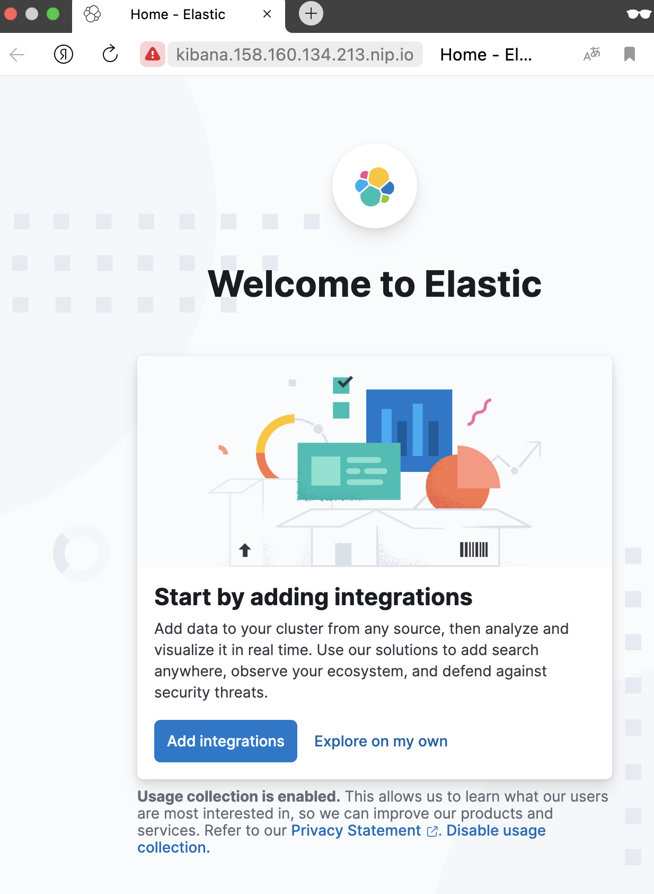
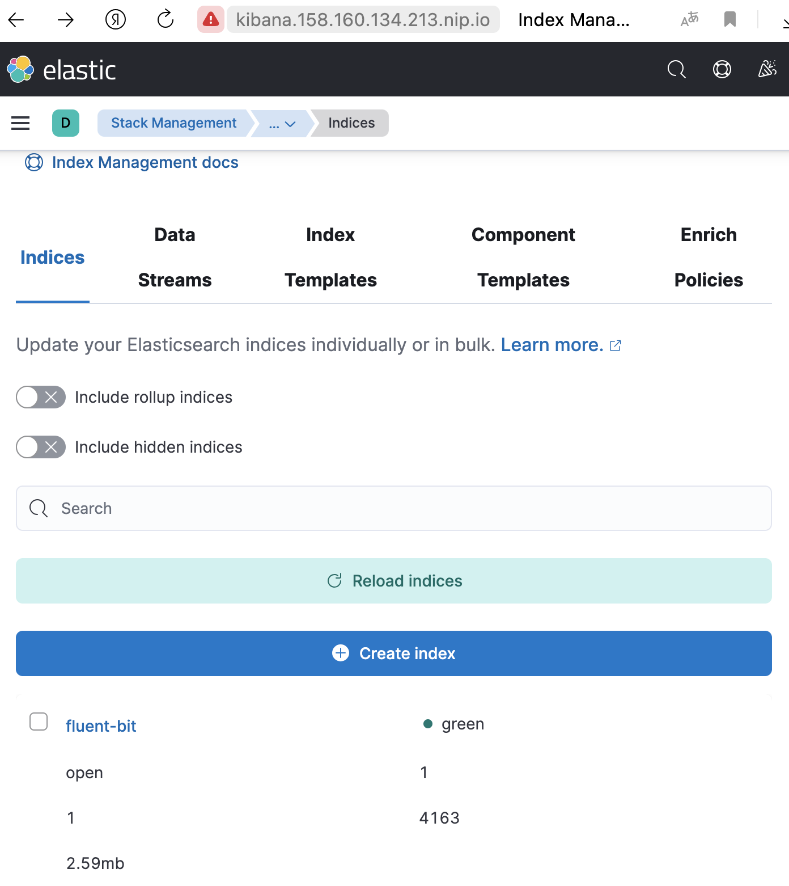
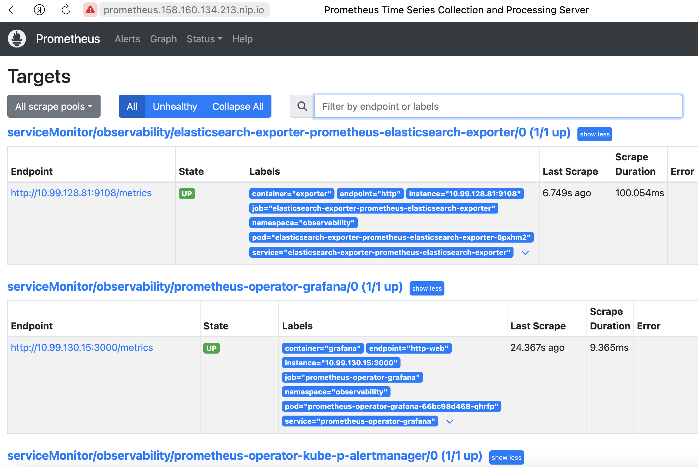
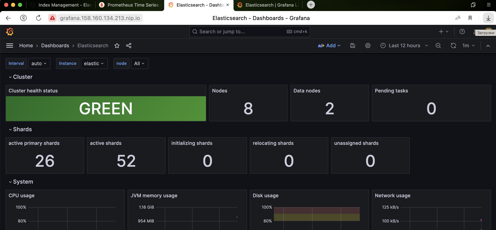

# Подготовка

Создаем необходимые сущности в Yandex Cloud [в соответствии с моим README по использованию скриптов-обёрток для yc](https://github.com/kodmandvl/wrapper_scripts/blob/main/yc/README.md) 

Затем с помощью утилиты yc на основе моих скриптиков-обёрток [yc_k8s_create.sh](https://github.com/kodmandvl/wrapper_scripts/blob/main/yc/yc_k8s_create.sh) и [yc_k8s_create_prod.sh](https://github.com/kodmandvl/wrapper_scripts/blob/main/yc/yc_k8s_create_prod.sh) создаем кластер Kubernetes и две группы узлов (как указано в ДЗ): 

Обновлённый скрипт создания кластера: [yc_k8s_create_new.sh](https://github.com/kodmandvl/wrapper_scripts/blob/main/yc/yc_k8s_create_new.sh) 

Отмечу, что из-за [ограничений пробного периода Yandex Cloud](https://cloud.yandex.ru/docs/free-trial/concepts/limits) для инфраструктурной группы узлов взял HDD-диски. 

Создание кластера с двумя группами узлов (в скрипте для использования добавил свою учетную запись в ОС на нодах и публичный SSH ключ): 

```bash
yc_k8s_create_new.sh loghw 1.27 10.99.0.0/16 10.55.0.0/16 default-pool 1 infra-pool 3
```

(часть вывода заменена многоточиями) 

```
CREATING loghw YC MANAGED-KUBERNETES CLUSTER AFTER 5 SECONDS...

done (8m34s)
id: ..........
folder_id: ..........
created_at: "2023-12-17T12:09:04Z"
name: loghw
description: My_K8S_cluster_for_loghw
status: RUNNING
health: HEALTHY
network_id: ..........
..................................................

GET loghw CLUSTER:

..................................................

GET CREDENTIALS FOR loghw CLUSTER:

..................................................

LIST CLUSTERS:

+----------------------+-------+---------------------+---------+---------+----------------------+---------------------+
|          ID          | NAME  |     CREATED AT      | HEALTH  | STATUS  |  EXTERNAL ENDPOINT   |  INTERNAL ENDPOINT  |
+----------------------+-------+---------------------+---------+---------+----------------------+---------------------+
| cat9cmql0o6cul0m6hds | loghw | 2023-12-17 12:09:04 | HEALTHY | RUNNING | ..........           | ..........          |
+----------------------+-------+---------------------+---------+---------+----------------------+---------------------+

CREATING SSD NODE GROUP FOR loghw YC MANAGED-KUBERNETES CLUSTER AFTER 5 SECONDS...

done (1m41s)
id: ..........
cluster_id: ..........
created_at: "2023-12-17T12:17:48Z"
name: default-pool
status: RUNNING
node_template:
  name: node{instance.index}-default-pool
  platform_id: standard-v3
  resources_spec:
    memory: "8589934592"
    cores: "2"
    core_fraction: "100"
  boot_disk_spec:
    disk_type_id: network-ssd
    disk_size: "68719476736"
..................................................

GET default-pool NODE GROUP:

..................................................

LIST NODES FROM default-pool NODE GROUP:

+--------------------------------+--------------------+--------------------------------+-------------+--------+
|         CLOUD INSTANCE         |  KUBERNETES NODE   |           RESOURCES            |    DISK     | STATUS |
+--------------------------------+--------------------+--------------------------------+-------------+--------+
| fhm0b0b1tm3vcqg30vc7           | node1-default-pool | 2 100% core(s), 8.0 GB of      | 64.0 GB ssd | READY  |
| RUNNING_ACTUAL                 |                    | memory                         |             |        |
+--------------------------------+--------------------+--------------------------------+-------------+--------+

CREATING HDD NODE GROUP FOR loghw YC MANAGED-KUBERNETES CLUSTER AFTER 5 SECONDS...

done (2m7s)
id: ..........
cluster_id: ..........
created_at: "2023-12-17T12:19:40Z"
name: infra-pool
status: RUNNING
node_template:
  name: node{instance.index}-infra-pool
  platform_id: standard-v3
  resources_spec:
    memory: "8589934592"
    cores: "2"
    core_fraction: "100"
  boot_disk_spec:
    disk_type_id: network-hdd
    disk_size: "68719476736"
..................................................

GET infra-pool NODE GROUP:

..................................................

LIST NODES FROM infra-pool NODE GROUP:

+--------------------------------+------------------+--------------------------------+-------------+--------+
|         CLOUD INSTANCE         | KUBERNETES NODE  |           RESOURCES            |    DISK     | STATUS |
+--------------------------------+------------------+--------------------------------+-------------+--------+
| fhmjrg7cvf1p4t4cj5qk           | node1-infra-pool | 2 100% core(s), 8.0 GB of      | 64.0 GB hdd | READY  |
| RUNNING_ACTUAL                 |                  | memory                         |             |        |
| fhm9flct8kuona25sfrc           | node2-infra-pool | 2 100% core(s), 8.0 GB of      | 64.0 GB hdd | READY  |
| RUNNING_ACTUAL                 |                  | memory                         |             |        |
| fhm0dbjmf6kgd77ahqb7           | node3-infra-pool | 2 100% core(s), 8.0 GB of      | 64.0 GB hdd | READY  |
| RUNNING_ACTUAL                 |                  | memory                         |             |        |
+--------------------------------+------------------+--------------------------------+-------------+--------+

GET NODES OF loghw CLUSTER:

NAME                 STATUS   ROLES    AGE     VERSION   INTERNAL-IP   EXTERNAL-IP       OS-IMAGE             KERNEL-VERSION      CONTAINER-RUNTIME
node1-default-pool   Ready    <none>   2m31s   v1.27.3   ..........    ..........        Ubuntu 20.04.6 LTS   5.4.0-153-generic   containerd://1.6.21
node1-infra-pool     Ready    <none>   28s     v1.27.3   ..........    ..........        Ubuntu 20.04.6 LTS   5.4.0-153-generic   containerd://1.6.21
node2-infra-pool     Ready    <none>   7s      v1.27.3   ..........    ..........        Ubuntu 20.04.6 LTS   5.4.0-153-generic   containerd://1.6.21
node3-infra-pool     Ready    <none>   29s     v1.27.3   ..........    ..........        Ubuntu 20.04.6 LTS   5.4.0-153-generic   containerd://1.6.21

DONE.
```

Ноды (краткий вывод): 

```bash
k get nodes
```

```
NAME                 STATUS   ROLES    AGE   VERSION
node1-default-pool   Ready    <none>   39m   v1.27.3
node1-infra-pool     Ready    <none>   37m   v1.27.3
node2-infra-pool     Ready    <none>   37m   v1.27.3
node3-infra-pool     Ready    <none>   37m   v1.27.3
```

Как можно догадаться из названия, мы планируем отдать три из четырех нод кластера под инфраструктурные сервисы. 

Присвоим этим нодам определенный taint, чтобы избежать запуска на них случайных pod: 

```bash
kubectl taint nodes node1-infra-pool node-role=infra:NoSchedule
kubectl taint nodes node2-infra-pool node-role=infra:NoSchedule
kubectl taint nodes node3-infra-pool node-role=infra:NoSchedule
```

```
node/node1-infra-pool tainted
node/node2-infra-pool tainted
node/node3-infra-pool tainted
```

Еще подготовки: 

```
mkdir -p kubernetes-logging  && cd kubernetes-logging/

cp -aiv ../README.md ./
```

# Установка HipsterShop

Для начала, установим в Kubernetes кластер уже знакомый нам HipsterShop. 

Самый простой способ сделать это - применить подготовленный манифест: 

```bash
kubectl create ns microservices-demo
kubectl apply -f https://raw.githubusercontent.com/express42/otus-platform-snippets/master/Module-02/Logging/microservices-demo-without-resources.yaml -n microservices-demo
```

Проверьте, что все pod развернулись на ноде из default-pool: 

```bash
kubectl get pods -n microservices-demo -o wide
```

```
NAME                                     READY   STATUS             RESTARTS      AGE     IP             NODE                 NOMINATED NODE   READINESS GATES
adservice-6fd74fc798-cwsm4               0/1     ErrImagePull       0             2m53s   10.99.128.22   node1-default-pool   <none>           <none>
cartservice-5dd4d85f87-4k2fm             1/1     Running            3 (69s ago)   2m54s   10.99.128.17   node1-default-pool   <none>           <none>
checkoutservice-5c5cf676b6-4r7b2         1/1     Running            0             2m55s   10.99.128.12   node1-default-pool   <none>           <none>
currencyservice-d96b89c8-xk6x9           1/1     Running            0             2m53s   10.99.128.19   node1-default-pool   <none>           <none>
emailservice-56fdb57578-wpbd9            1/1     Running            0             2m55s   10.99.128.11   node1-default-pool   <none>           <none>
frontend-676b857c88-tc8zx                1/1     Running            0             2m54s   10.99.128.14   node1-default-pool   <none>           <none>
loadgenerator-69fcc9b999-7xk6t           0/1     CrashLoopBackOff   3 (35s ago)   2m54s   10.99.128.18   node1-default-pool   <none>           <none>
paymentservice-79fd94cdd8-46wqv          1/1     Running            0             2m54s   10.99.128.15   node1-default-pool   <none>           <none>
productcatalogservice-5d549b95d-ppkss    1/1     Running            0             2m54s   10.99.128.16   node1-default-pool   <none>           <none>
recommendationservice-576949cfbb-4rb44   1/1     Running            0             2m55s   10.99.128.13   node1-default-pool   <none>           <none>
redis-cart-6bd7c54f5c-vm8v7              1/1     Running            0             2m53s   10.99.128.21   node1-default-pool   <none>           <none>
shippingservice-66cf7778dd-6gg68         1/1     Running            0             2m53s   10.99.128.20   node1-default-pool   <none>           <none>
```

# Установка EFK стека | Helm charts

Рекомендуемый репозиторий с Helm chart для ElasticSearch и Kibana на текущий момент - https://github.com/elastic/helm-charts 

Добавим его: 

```bash
helm repo add elastic https://helm.elastic.co
helm repo add stable https://charts.helm.sh/stable
helm repo list
```

И установим нужные нам компоненты, для начала - без какой-либо дополнительной настройки: 

```bash
kubectl create ns observability
# ElasticSearch
helm upgrade --install elasticsearch elastic/elasticsearch --namespace observability
# Kibana
helm upgrade --install kibana elastic/kibana --namespace observability
# Fluent Bit
helm upgrade --install fluent-bit stable/fluent-bit --namespace observability
```

Ошибка, не удается установить: 

```
$ kubectl create ns observability
namespace/observability created
$ helm upgrade --install elasticsearch elastic/elasticsearch --namespace observability
Release "elasticsearch" does not exist. Installing it now.
Error: failed to fetch https://helm.elastic.co/helm/elasticsearch/elasticsearch-8.5.1.tgz : 403 Forbidden
$ helm upgrade --install kibana elastic/kibana --namespace observability
Release "kibana" does not exist. Installing it now.
Error: failed to fetch https://helm.elastic.co/helm/kibana/kibana-8.5.1.tgz : 403 Forbidden
```

Fluent-Bit: 

```
$ helm upgrade --install fluent-bit stable/fluent-bit --namespace observability
Release "fluent-bit" does not exist. Installing it now.
WARNING: This chart is deprecated
NAME: fluent-bit
LAST DEPLOYED: Mon Dec 18 12:30:23 2023
NAMESPACE: observability
STATUS: deployed
REVISION: 1
NOTES:
fluent-bit is now running.

It will forward all container logs to the svc named fluentd on port: 24284
```

Для ElasticSearch и Kibana попробуем использовать чарты bitnami:

```bash
helm repo add bitnami https://charts.bitnami.com/bitnami
helm repo update bitnami
helm upgrade --install elasticsearch bitnami/elasticsearch --namespace observability
helm upgrade --install kibana bitnami/kibana --namespace observability
kubectl get pods -n observability -o wide
```

```
$ helm upgrade --install elasticsearch bitnami/elasticsearch --namespace observability
Release "elasticsearch" does not exist. Installing it now.
NAME: elasticsearch
LAST DEPLOYED: Mon Dec 18 12:32:15 2023
NAMESPACE: observability
STATUS: deployed
REVISION: 1
TEST SUITE: None
NOTES:
CHART NAME: elasticsearch
CHART VERSION: 19.13.14
APP VERSION: 8.11.3

-------------------------------------------------------------------------------
 WARNING

    Elasticsearch requires some changes in the kernel of the host machine to
    work as expected. If those values are not set in the underlying operating
    system, the ES containers fail to boot with ERROR messages.

    More information about these requirements can be found in the links below:

      https://www.elastic.co/guide/en/elasticsearch/reference/current/file-descriptors.html
      https://www.elastic.co/guide/en/elasticsearch/reference/current/vm-max-map-count.html

    This chart uses a privileged initContainer to change those settings in the Kernel
    by running: sysctl -w vm.max_map_count=262144 && sysctl -w fs.file-max=65536

** Please be patient while the chart is being deployed **

  Elasticsearch can be accessed within the cluster on port 9200 at elasticsearch.observability.svc.cluster.local

  To access from outside the cluster execute the following commands:

    kubectl port-forward --namespace observability svc/elasticsearch 9200:9200 &
    curl http://127.0.0.1:9200/
```

```
$ helm upgrade --install kibana bitnami/kibana --namespace observability
Release "kibana" does not exist. Installing it now.
NAME: kibana
LAST DEPLOYED: Mon Dec 18 12:33:53 2023
NAMESPACE: observability
STATUS: deployed
REVISION: 1
TEST SUITE: None
NOTES:
CHART NAME: kibana
CHART VERSION: 10.6.5
APP VERSION: 8.11.3

** Please be patient while the chart is being deployed **######################################################################################################
### ERROR: You did not provide the Elasticsearch external host or port in your 'helm install' call ###
######################################################################################################

Complete your Kibana deployment by running:

  helm upgrade --namespace observability kibana oci://registry-1.docker.io/bitnamicharts/kibana \
    --set elasticsearch.hosts[0]=YOUR_ES_HOST,elasticsearch.port=YOUR_ES_PORT

Replacing "YOUR_ES_HOST" and "YOUR_ES_PORT" placeholders by the proper values of your Elasticsearch deployment.
```

```
$ kubectl get pods -n observability -o wide
NAME                           READY   STATUS    RESTARTS        AGE    IP             NODE                 NOMINATED NODE   READINESS GATES
elasticsearch-coordinating-0   0/1     Running   2 (40s ago)     9m1s   10.99.128.41   node1-default-pool   <none>           <none>
elasticsearch-coordinating-1   0/1     Running   2 (40s ago)     9m1s   10.99.128.43   node1-default-pool   <none>           <none>
elasticsearch-data-0           0/1     Running   2 (38s ago)     9m1s   10.99.128.45   node1-default-pool   <none>           <none>
elasticsearch-data-1           0/1     Running   2 (32s ago)     9m1s   10.99.128.48   node1-default-pool   <none>           <none>
elasticsearch-ingest-0         0/1     Running   2 (40s ago)     9m1s   10.99.128.42   node1-default-pool   <none>           <none>
elasticsearch-ingest-1         0/1     Running   2 (40s ago)     9m1s   10.99.128.44   node1-default-pool   <none>           <none>
elasticsearch-master-0         0/1     Running   1 (3m12s ago)   9m1s   10.99.128.46   node1-default-pool   <none>           <none>
elasticsearch-master-1         0/1     Running   1 (3m13s ago)   9m1s   10.99.128.47   node1-default-pool   <none>           <none>
fluent-bit-j2trt               1/1     Running   0               10m    10.99.128.40   node1-default-pool   <none>           <none>
```

```
$ yc managed-kubernetes node-group list                          
+----------------------+----------------------+--------------+----------------------+---------------------+---------+------+
|          ID          |      CLUSTER ID      |     NAME     |  INSTANCE GROUP ID   |     CREATED AT      | STATUS  | SIZE |
+----------------------+----------------------+--------------+----------------------+---------------------+---------+------+
| cat8r1gtkvf4kds78kmf | cat9cmql0o6cul0m6hds | infra-pool   | cl1vrb877jf3l8lgneea | 2023-12-17 12:19:40 | RUNNING |    3 |
| catjadeeft27ma5hkn75 | cat9cmql0o6cul0m6hds | default-pool | cl1g82qhaobb7na8d3tu | 2023-12-17 12:17:48 | RUNNING |    1 |
+----------------------+----------------------+--------------+----------------------+---------------------+---------+------+
```

Создайте в директории kubernetes-logging файл elasticsearch.values.yaml , будем указывать в этом файле нужные нам
values. 

Для начала, обратимся к файлу `values.yaml` в и найдем там ключ `tolerations`. Мы помним, что ноды из `infra-pool` имеют `taint` `node-role=infra:NoSchedule`. 
Давайте разрешим ElasticSearch запускаться на данных нодах: 

```yaml
tolerations:
  - key: node-role
    operator: Equal
    value: infra
    effect: NoSchedule
```

```bash
helm upgrade --install elasticsearch bitnami/elasticsearch --namespace observability -f elasticsearch.values.yaml
```

Теперь ElasticSearch может запускаться на нодах из `infra-pool`, но это не означает, что он должен это делать.
Исправим этот момент и добавим в `elasticsearch.values.yaml` NodeSelector, определяющий, на каких нодах мы можем 
запускать наши `pod`. Исправляем: 

```yaml
nodeSelector:
  yandex.cloud/node-group-id: cat8r1gtkvf4kds78kmf
tolerations: 
  - key: node-role
    operator: Equal
    value: infra
    effect: NoSchedule
   
```bash
helm uninstall elasticsearch --namespace observability
helm upgrade --install elasticsearch bitnami/elasticsearch --namespace observability -f elasticsearch.values.yaml
kubectl get pods -n observability -o wide
```

```
$ kubectl get pods -n observability -o wide                                                                        
NAME                           READY   STATUS     RESTARTS   AGE   IP             NODE                 NOMINATED NODE   READINESS GATES
elasticsearch-coordinating-0   0/1     Init:0/1   0          10s   <none>         node1-infra-pool     <none>           <none>
elasticsearch-coordinating-1   0/1     Init:0/1   0          10s   10.99.129.8    node3-infra-pool     <none>           <none>
elasticsearch-data-0           0/1     Init:0/1   0          10s   <none>         node3-infra-pool     <none>           <none>
elasticsearch-data-1           0/1     Init:0/1   0          10s   <none>         node2-infra-pool     <none>           <none>
elasticsearch-ingest-0         0/1     Init:0/1   0          10s   10.99.130.5    node1-infra-pool     <none>           <none>
elasticsearch-ingest-1         0/1     Init:0/1   0          10s   10.99.131.5    node2-infra-pool     <none>           <none>
elasticsearch-master-0         0/1     Init:0/1   0          10s   <none>         node2-infra-pool     <none>           <none>
elasticsearch-master-1         0/1     Init:0/1   0          10s   <none>         node1-infra-pool     <none>           <none>
fluent-bit-j2trt               1/1     Running    0          37m   10.99.128.40   node1-default-pool   <none>           <none>
```

Поды ElasticSearch размещаются на нодах группы infra-pool (ID группы cat8r1gtkvf4kds78kmf). 
Для Fluent-Bit пока не настраивали values. 

# Установка nginx-ingress | Самостоятельное задание

Поставим на основе успешной установки из ДЗ kubernetes-templating (там у себя в readme нашел актуальный helm-репозиторий). 
А пример values из методических указаний. 

```bash
helm repo add ingress-nginx https://kubernetes.github.io/ingress-nginx
helm repo update ingress-nginx
kubectl create ns nginx-ingress
helm upgrade --install nginx-ingress ingress-nginx/ingress-nginx --namespace nginx-ingress --atomic --wait -f nginx-ingress.values.yaml
kubectl get pods -n nginx-ingress -o wide
```

```
$ kubectl get pods -n nginx-ingress -o wide
NAME                                                      READY   STATUS    RESTARTS   AGE    IP             NODE               NOMINATED NODE   READINESS GATES
nginx-ingress-ingress-nginx-controller-76fd9fcbb7-7f8hn   1/1     Running   0          2m9s   10.99.131.8    node2-infra-pool   <none>           <none>
nginx-ingress-ingress-nginx-controller-76fd9fcbb7-8s7md   1/1     Running   0          2m9s   10.99.129.10   node3-infra-pool   <none>           <none>
nginx-ingress-ingress-nginx-controller-76fd9fcbb7-h6rln   1/1     Running   0          2m9s   10.99.130.8    node1-infra-pool   <none>           <none>
```

# Установка  EFK стека | Kibana

```
$ k get svc -n nginx-ingress
NAME                                               TYPE           CLUSTER-IP      EXTERNAL-IP       PORT(S)                      AGE
nginx-ingress-ingress-nginx-controller             LoadBalancer   10.55.173.77    158.160.134.213   80:32363/TCP,443:31811/TCP   20m
nginx-ingress-ingress-nginx-controller-admission   ClusterIP      10.55.223.230   <none>            443/TCP                      20m
```

По традиции создадим файл `kibana.values.yaml` в директории `kubernetes-logging` и добавим туда конфигурацию для 
создания ingress:

```yaml
ingress:
  enabled: true
  ingressClassName: nginx
  path: /
  hostname: kibana.158.160.134.213.nip.io
```

```bash
# Kibana
helm upgrade --install kibana bitnami/kibana --namespace observability --set "elasticsearch.hosts[0]=elasticsearch,elasticsearch.port=9200" -f kibana.values.yaml
```

```
$ helm upgrade --install kibana bitnami/kibana --namespace observability --set "elasticsearch.hosts[0]=elasticsearch,elasticsearch.port=9200" -f kibana.values.yaml
false
Release "kibana" has been upgraded. Happy Helming!
NAME: kibana
LAST DEPLOYED: Mon Dec 18 13:49:20 2023
NAMESPACE: observability
STATUS: deployed
REVISION: 2
TEST SUITE: None
NOTES:
CHART NAME: kibana
CHART VERSION: 10.6.5
APP VERSION: 8.11.3

** Please be patient while the chart is being deployed **

1. Get the application URL by running these commands:
  Get the Kibana URL and associate Kibana hostname to your cluster external IP:

   export CLUSTER_IP=$(minikube ip) # On Minikube. Use: `kubectl cluster-info` on others K8s clusters
   echo "Kibana URL: http://kibana.158.160.134.213.nip.io/"
   echo "$CLUSTER_IP  kibana.158.160.134.213.nip.io" | sudo tee -a /etc/hosts

WARNING: Kibana is externally accessible from the cluster but the dashboard does not contain authentication mechanisms. Make sure you follow the authentication guidelines in your Elastic stack.
+info https://www.elastic.co/guide/en/elasticsearch/reference/current/setting-up-authentication.html
```

Kibana открывается по адресу http://kibana.158.160.134.213.nip.io : 

 

Видим, что в ElasticSearch пока что не обнаружено никаких данных. 
Посмотрим в логи решения, которое отвечает за отправку логов (Fluent Bit), и увидим следующие строки: 

```bash
kubectl logs -n observability -l app=fluent-bit --tail 2
```

```text
[2023/12/18 17:16:46] [error] [out_fw] no upstream connections available
[2023/12/18 17:16:46] [ warn] [engine] failed to flush chunk '1-1702918825.457018983.flb', retry in 490 seconds: task_id=55, input=tail.0 > output=forward.0
```

# Установка  EFK стека | Fluent Bit

```yaml
config:
  outputs: |
    [OUTPUT]
        Name  es
        Match *
        Host  elasticsearch
        Port  9200
        Suppress_Type_Name On
        Replace_Dots    On
   
tolerations:
  - key: node-role
    operator: Equal
    value: infra
    effect: NoSchedule
```

Документация и пример конфиурации [здесь](https://docs.fluentbit.io/manual/pipeline/outputs/elasticsearch) 

Устанавливаем: 

```bash
helm repo add fluent https://fluent.github.io/helm-charts
helm repo update fluent
helm uninstall fluent-bit --namespace observability 
helm upgrade --install fluent-bit fluent/fluent-bit --namespace observability -f fluentbit.values.yaml
```

```text
Release "fluent-bit" does not exist. Installing it now.
NAME: fluent-bit
LAST DEPLOYED: Tue Dec 19 12:22:47 2023
NAMESPACE: observability
STATUS: deployed
REVISION: 1
NOTES:
Get Fluent Bit build information by running these commands:

export POD_NAME=$(kubectl get pods --namespace observability -l "app.kubernetes.io/name=fluent-bit,app.kubernetes.io/instance=fluent-bit" -o jsonpath="{.items[0].metadata.name}")
kubectl --namespace observability port-forward $POD_NAME 2020:2020
curl http://127.0.0.1:2020
```

```bash
kubectl get pod -n observability -l app.kubernetes.io/instance=fluent-bit -o wide
```

Fluent-bit выполняется на всех нодах (насколько я помню, он как раз helm-ом разворачивается как DaemonSet): 

```text
NAME               READY   STATUS    RESTARTS   AGE   IP             NODE                 NOMINATED NODE   READINESS GATES
fluent-bit-2mwjs   1/1     Running   0          61s   10.99.130.14   node1-infra-pool     <none>           <none>
fluent-bit-c5chr   1/1     Running   0          61s   10.99.129.16   node3-infra-pool     <none>           <none>
fluent-bit-ddv42   1/1     Running   0          61s   10.99.128.74   node1-default-pool   <none>           <none>
fluent-bit-f8xq7   1/1     Running   0          61s   10.99.131.14   node2-infra-pool     <none>           <none>
```

Попробуем повторно создать `index pattern`. В этот раз ситуация изменилась, и какие-то индексы в ElasticSearch уже есть: 

 

# Мониторинг ElasticSearch

Помимо установки ElasticSearch, важно отслеживать его показатели и вовремя понимать, что пора предпринять какие-либо действия. 

Для мониторинга ElasticSearch будем использовать [следующий Prometheus exporter](https://github.com/prometheus-community/elasticsearch_exporter) 

* Установите prometheus-operator в namespace observability любым удобным вам способом 

* Установите упомянутый выше exporter 

```bash
helm repo add prometheus-community https://prometheus-community.github.io/helm-charts
helm upgrade --install prometheus-operator prometheus-community/kube-prometheus-stack -n observability -f prometheus.values.yaml
```

```text
Release "prometheus-operator" does not exist. Installing it now.
NAME: prometheus-operator
LAST DEPLOYED: Mon Dec 18 22:19:12 2023
NAMESPACE: observability
STATUS: deployed
REVISION: 1
NOTES:
kube-prometheus-stack has been installed. Check its status by running:
  kubectl --namespace observability get pods -l "release=prometheus-operator"

Visit https://github.com/prometheus-operator/kube-prometheus for instructions on how to create & configure Alertmanager and Prometheus instances using the Operator.
```

```bash
helm upgrade --install elasticsearch-exporter prometheus-community/prometheus-elasticsearch-exporter --set es.uri=http://elasticsearch:9200 --set serviceMonitor.enabled=true --namespace=observability
```

```text
Release "elasticsearch-exporter" does not exist. Installing it now.
NAME: elasticsearch-exporter
LAST DEPLOYED: Mon Dec 18 22:23:32 2023
NAMESPACE: observability
STATUS: deployed
REVISION: 1
TEST SUITE: None
NOTES:
1. Get the application URL by running these commands:
  export POD_NAME=$(kubectl get pods --namespace observability -l "app=elasticsearch-exporter-prometheus-elasticsearch-exporter" -o jsonpath="{.items[0].metadata.name}")
  echo "Visit http://127.0.0.1:9108/metrics to use your application"
  kubectl port-forward $POD_NAME 9108:9108 --namespace observability
```

Открываем Prometheus по ссылке http://prometheus.158.160.134.213.nip.io : 

 

Открываем Grafana по ссылке http://grafana.158.160.134.213.nip.io 

Импортируем в Grafana [один из популярных Dashboard для ElasticSearch exporter](https://grafana.com/grafana/dashboards/4358-elasticsearch/), содержащий визуализацию основных собираемых метрик: 

 

```bash
kubectl drain node3-infra-pool --ignore-daemonsets
# после:
kubectl uncordon node3-infra-pool
```

# EFK | nginx ingress

Попробуем найти в Kibana логи nginx-ingress (например, полнотекстовым поиском по слову nginx ) и обнаружим, что они отсутствуют. 
Добейтесь того, чтобы эти логи появились. 

Добавим раздел `config` в `nginx-ingress.values.yaml`, чтобы логи ingress-nginx попадали в Kibana. 

Переустановим Nginx-Ingress: 

```bash
helm upgrade --install nginx-ingress ingress-nginx/ingress-nginx --namespace nginx-ingress --atomic --wait -f nginx-ingress.values.yaml
kubectl get pods -n nginx-ingress -o wide
```

# Loki

Установите Loki в namespace `observability`, используя любой способ. 

Должны быть установлены непосредственно Loki и Promtail 

```bash
helm repo add grafana https://grafana.github.io/helm-charts
helm repo update grafana
helm upgrade --install loki grafana/loki-distributed -n observability -f loki.values.yaml
```

```text
Release "loki" does not exist. Installing it now.
NAME: loki
LAST DEPLOYED: Tue Dec 19 12:45:17 2023
NAMESPACE: observability
STATUS: deployed
REVISION: 1
TEST SUITE: None
NOTES:
***********************************************************************
 Welcome to Grafana Loki
 Chart version: 0.77.0
 Loki version: 2.9.2
***********************************************************************

Installed components:
* gateway
* ingester
* distributor
* querier
* query-frontend
```

```bash
helm upgrade --install promtail grafana/promtail -n observability -f promtail.values.yaml
```

```text
Release "promtail" does not exist. Installing it now.
NAME: promtail
LAST DEPLOYED: Tue Dec 19 12:46:16 2023
NAMESPACE: observability
STATUS: deployed
REVISION: 1
TEST SUITE: None
NOTES:
***********************************************************************
 Welcome to Grafana Promtail
 Chart version: 6.15.3
 Promtail version: 2.9.2
***********************************************************************

Verify the application is working by running these commands:
* kubectl --namespace observability port-forward daemonset/promtail 3101
* curl http://127.0.0.1:3101/metrics
```

Модифицируйте конфигурацию `prometheus-operator` таким образом, чтобы datasource Loki создавался сразу после установки оператора. 

Итоговый файл prometheus-operator.values.yaml выложите в репозиторий в директорию kubernetes-logging 

# git checkout, create directory, copy files, pull request:

```
cd ~/kodmandvl_platform/
git pull ; git status
ls
git branch
git checkout -b kubernetes-logging 
git branch
mkdir kubernetes-logging 
# Копируем файлы из места, где выполнял задание, в ~/kodmandvl_platform/kubernetes-logging/
# Далее:
git status
git add -A
git status
git commit -m "kubernetes-logging"
git push --set-upstream origin kubernetes-logging
git status
# И далее Pull Request, кнопка "Отправить на проверку ДЗ", мёрж после проверки.
# Если здесь нужно переключить обратно на ветку main, то:
git branch
git switch main
git branch
git status
```

# ТЕКСТ ДЛЯ PULL REQUEST:

# Выполнено ДЗ № kubernetes-logging 

 - [OK] Основное ДЗ

## В процессе сделано:
 - Все пункты по порядку по методическим указаниям (также описано в README.md)

## Как запустить проект:
 - Усатновка с помощью Helm с использованием файлов values.yaml

## Как проверить работоспособность:
 - Выполнить соответствующие команды kubectl и открыть в браузере kibana, prometheus, grafana

## PR checklist:
 - [OK] Выставлен label с темой домашнего задания

# ТЕКСТ ДЛЯ ОТПРАВКИ В ЧАТ ПРОВЕРКИ ДЗ:

Добрый день! 

ДЗ № kubernetes-logging отправлено на проверку. 

Ссылка на PR: 

https://github.com/otus-kuber-2023-08/kodmandvl_platform/pull/номерpr 

