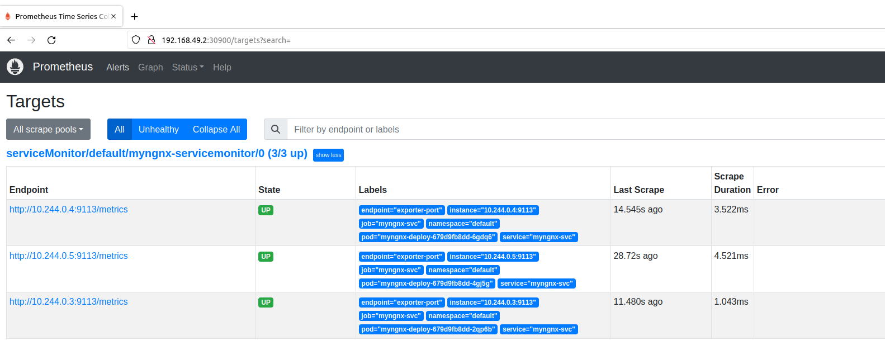
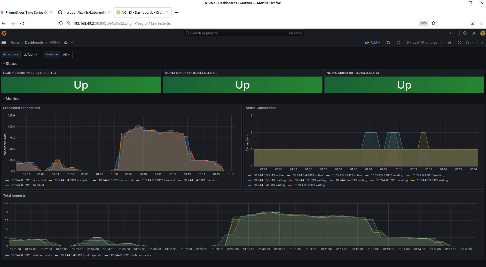

# Подготовка 

```
mkdir -p kubernetes-monitoring && cd kubernetes-monitoring/
cp -aiv ../README.md ./
```

## Запуск кластера 

Возьмем minikube (с драйвером docker, а не virtualbox, т.к. запускал внутри ВМ): 

```
minikube start -p minikube --kubernetes-version=v1.24.16 --driver=docker --cpus=3 --memory=6144m
minikube profile list
minikube status
```

## Посмотреть: 

```
kubectl get all -A -o wide
kubectl get pods -A -o wide
kubectl get nodes -o wide
```

# Сборка кастомного образа | Запустим свой nginx 

Я долго экспериментировал. 

В итоге запушил [4 версии на Docker Hub](https://hub.docker.com/repository/docker/kodmandvl/mynginx/general). 

Исходники и подробности по полученным образам - [на Git Hub](https://github.com/kodmandvl/mynginx_images). 

- я взял из образа на основе nginx:1.25.2-alpine-slim, сделал вывод обычного index.html + вывод котёночка =^.^= (версия v1) 
- плюс добавил модуль stub_status, как в [методических указаниях](https://nginx.org/ru/docs/http/ngx_http_stub_status_module.html) и книге Nginx Cookbook (версия v2) 
- плюс для удобства и интереса (и чтобы хоть что-то полезное выводилось) сделал вывод hostname пода, его IP адреса и времени создания (по аналогии с luksa/kubia или с примером из первого домашнего задания с вэб-сервером и init-контейнером), для этого пытался разные простые варианты попробовать, долго исследовал и остановился на добавлении в эндпойнт-скрипт скриптика, формирующего index.html на этапе инициализации контейнера (версия v3) 
- но смущало, что работало на 80 порту под рутом, и в итоге переделал полностью, сделав отдельную рабочую директорию, другой порт, пользователя и др. изменения, для этого также обращался к книге Nginx Cookbook (v4, она же latest) 

В итоге получился удобный образ размером 11.9MB, который в будущем смогу использовать и для других таких тестовых/учебных примеров (использованные для сборки образа v4 файлы находятся в директории mynginx-image). 

Быстренько проверим: 

```
kubectl create ns myns
kubectl run myngnx --image=docker.io/kodmandvl/mynginx --port=8080 -n myns
kubectl get po -n myns -w
nohup kubectl port-forward myngnx 8080:8080 -n myns &
curl 127.0.0.1:8080
curl 127.0.0.1:8080/kitty.html
curl 127.0.0.1:8080/basic_status
kubectl expose -n myns pod/myngnx --port=8080 --type=NodePort --overrides '{ "spec":{"ports": [{"port":8080,"protocol":"TCP","targetPort":8080,"nodePort":30080}]}}'
kubectl get -n myns svc/myngnx -o yaml
kubectl get -n myns svc/myngnx -o wide
echo "curl `minikube ip`:30080 ; exit" | minikube ssh
echo "curl `minikube ip`:30080/kitty.html ; exit" | minikube ssh
echo "curl `minikube ip`:30080/basic_status ; exit" | minikube ssh
```

```
$ echo "curl `minikube ip`:30080/basic_status ; exit" | minikube ssh
curl 192.168.49.2:30080/basic_status ; exit
docker@minikube:~$ curl 192.168.49.2:30080/basic_status ; exit
Active connections: 1 
server accepts handled requests
 14 14 22 
Reading: 0 Writing: 1 Waiting: 0 
logout
```

Работает так, как и ожидалось. 

Удалим неймспейс myns и пересоздадим наш myngnx в виде деплоймента, а также пересоздадим сервис (за основу возьмем сейчас kubectl get -n myns svc/myngnx -o yaml перед удалением неймспейса и потом немного подправим полученный файл): 

```
kubectl get -n myns svc/myngnx -o yaml > ./myngnx-svc.yaml
```

Деплоим наше приложение mynginx: 

```
kubectl delete ns myns
kubectl apply -f myns-ns.yaml
kubectl apply -f myngnx-deploy.yaml
kubectl apply -f myngnx-svc.yaml
kubectl get all -n myns
ketall -n myns
kubectl logs -n myns deployments/myngnx-deploy
kubectl describe -n myns deployments/myngnx-deploy
kubectl get events -A -o wide -w
kubectl get events -n myns -o wide -w
```

```
$ kubectl get all -n myns -o wide
NAME                                 READY   STATUS    RESTARTS   AGE     IP            NODE       NOMINATED NODE   READINESS GATES
pod/myngnx-deploy-74b44d6c97-8fmmm   1/1     Running   0          4m46s   10.244.0.37   minikube   <none>           <none>
pod/myngnx-deploy-74b44d6c97-dltdv   1/1     Running   0          4m46s   10.244.0.35   minikube   <none>           <none>
pod/myngnx-deploy-74b44d6c97-xxsl4   1/1     Running   0          4m46s   10.244.0.36   minikube   <none>           <none>

NAME                 TYPE       CLUSTER-IP    EXTERNAL-IP   PORT(S)          AGE    SELECTOR
service/myngnx-svc   NodePort   10.111.73.4   <none>        8080:30080/TCP   4m8s   app=myngnx

NAME                            READY   UP-TO-DATE   AVAILABLE   AGE     CONTAINERS   IMAGES                               SELECTOR
deployment.apps/myngnx-deploy   3/3     3            3           4m46s   myngnx       docker.io/kodmandvl/mynginx:latest   app=myngnx

NAME                                       DESIRED   CURRENT   READY   AGE     CONTAINERS   IMAGES                               SELECTOR
replicaset.apps/myngnx-deploy-74b44d6c97   3         3         3       4m46s   myngnx       docker.io/kodmandvl/mynginx:latest   app=myngnx,pod-template-hash=74b44d6c97
```

Опять же проверим доступность (хотя в деплойменте добавлены readinessProbe и livenessProbe, но тем не менее): 

```
nohup kubectl port-forward -n myns svc/myngnx-svc 8080:8080 &
nohup kubectl port-forward -n myns pod/myngnx-deploy-74b44d6c97-8fmmm 8081:8080 &
nohup kubectl port-forward -n myns pod/myngnx-deploy-74b44d6c97-dltdv 8082:8080 &
nohup kubectl port-forward -n myns pod/myngnx-deploy-74b44d6c97-xxsl4 8083:8080 &
curl 127.0.0.1:8080/
curl 127.0.0.1:8080/kitty.html
curl 127.0.0.1:8080/basic_status
curl 127.0.0.1:8081/
curl 127.0.0.1:8082/
curl 127.0.0.1:8083/
curl 127.0.0.1:8081/basic_status
curl 127.0.0.1:8082/basic_status
curl 127.0.0.1:8083/basic_status
echo "curl `minikube ip`:30080 ; exit" | minikube ssh
echo "curl `minikube ip`:30080/basic_status ; exit" | minikube ssh
```

```
$ echo "curl `minikube ip`:30080 ; exit" | minikube ssh
curl 192.168.49.2:30080 ; exit
docker@minikube:~$ curl 192.168.49.2:30080 ; exit
<!DOCTYPE html>
<html>
<head>
<title>myngnx-deploy-74b44d6c97-xxsl4 - My Nginx v4 (based on nginx:1.25.2-alpine-slim)</title>
<style>
html { color-scheme: light dark; }
body { width: 35em; margin: 0 auto;
font-family: Tahoma, Verdana, Arial, sans-serif; }
</style>
</head>
<body>
<h1>Hello from Dimka!</h1>
<p>If you see this page, My Nginx v4 on myngnx-deploy-74b44d6c97-xxsl4 (based on nginx:1.25.2-alpine-slim) is successfully installed and
working.</p>
<p> HOST: myngnx-deploy-74b44d6c97-xxsl4 </p>
<p> IP: 10.244.0.36 </p>
<p> CREATED: 2023-10-27 00:58:35 MSK </p>
</body>
</html>
logout
$ echo "curl `minikube ip`:30080/basic_status ; exit" | minikube ssh
curl 192.168.49.2:30080/basic_status ; exit
docker@minikube:~$ curl 192.168.49.2:30080/basic_status ; exit
Active connections: 1 
server accepts handled requests
 139 139 77 
Reading: 0 Writing: 1 Waiting: 0 
logout
```

Всё работает так, как было задумано (кроме того, при нескольких попытках доступа через сервис попадаем на разные поды, о чем свидетельствуют разные имена подов и разные значения показаний счетчиков из stub_status). 

# Конфигурация nginx exporter 

Достаточно в аргументах указать -nginx.scrape-uri. 

Не забываем перед этим настроить service для оригинального пода 

(Если вы выбрали этот путь). 

[Ссылка на офф. документацию](https://github.com/nginxinc/nginx-prometheus-exporter) 

По приведенной выше ссылке приведен [очень удобный пример](https://raw.githubusercontent.com/nginxinc/nginx-prometheus-exporter/main/README.md), возьмем выдержки из него: 

### Prerequisites

We assume that you have already installed Prometheus and NGINX or NGINX Plus. Additionally, you need to:

- Expose the built-in metrics in NGINX/NGINX Plus:
  - For NGINX, expose the [stub_status
    page](https://nginx.org/en/docs/http/ngx_http_stub_status_module.html#stub_status) at `/stub_status` on port `8080`.
- Configure Prometheus to scrape metrics from the server with the exporter. Note that the default scrape port of the
  exporter is `9113` and the default metrics path -- `/metrics`.

### Running the Exporter in a Docker Container

To start the exporter we use the [docker run](https://docs.docker.com/engine/reference/run/) command.

- To export NGINX metrics, run:

    ```console
    docker run -p 9113:9113 nginx/nginx-prometheus-exporter:0.10.0 -nginx.scrape-uri=http://<nginx>:8080/stub_status
    ```

    where `<nginx>` is the IP address/DNS name, through which NGINX is available. 

### Running the Exporter Binary

- To export NGINX metrics, run:

    ```console
    nginx-prometheus-exporter -nginx.scrape-uri=http://<nginx>:8080/stub_status
    ```

    where `<nginx>` is the IP address/DNS name, through which NGINX is available. 

- To export and scrape NGINX metrics with unix domain sockets, run:

    ```console
    nginx-prometheus-exporter -nginx.scrape-uri=unix:<nginx>:/stub_status -web.listen-address=unix:/path/to/socket.sock
    ```

    where `<nginx>` is the path to unix domain socket, through which NGINX stub status is available. 

(Но в нашем случае помним, что stub_status выводим как basic_status) 

Попробуем запустить через run и проверить, что работает, после чего уже создадим деплоймент и сервис. 

Использовать будем тот же неймспейс, т.к. само приложение и его экспортёр идут в связке, с моей т.з. 

```
kubectl run nginx-exporter -n myns --port=9113 --image=nginx/nginx-prometheus-exporter:0.10.0 -- -nginx.scrape-uri=http://myngnx-svc:8080/basic_status
kubectl get po -n myns -w
nohup kubectl port-forward nginx-exporter 9113:9113 -n myns &
curl 127.0.0.1:9113
curl 127.0.0.1:9113/metrics
```

Как бы всё работает. 

Также попробовал создать pod nginx-exporter с аргументом -nginx.scrape-uri=http://IP-одного-из-подов-nginx:8080/basic_status), так тоже работает: 

```
kubectl run nginx-exporter -n myns --port=9113 --image=nginx/nginx-prometheus-exporter:0.10.0 -- -nginx.scrape-uri=http://10.244.0.36:8080/basic_status
```

Но на этом шаге осознал неверность такой концепции: на разных подах nginx разные значения метрик (счётчиков), с сервиса мы можем потенциально произвольно попасть на разные поды нашего Nginx, поэтому их логичнее было бы собирать с каждого пода Nginx, а не с сервиса. 
Иначе мы часть метрик не видим и они будут непостоянными (что даже для учебного примера как-то не очень). 
Поэтому на данном шаге я решил переделать деплоймент и сервис для nginx, добавив туда экспортёр и порт для него, соответственно. 

Оригинальные деплоймент и сервис (myngnx-deploy.yaml и myngnx-svc.yaml) решил сохранить для истории. 

Новые файлы будут: myngnx-and-exporter-deploy.yaml и myngnx-and-exporter-svc.yaml 

Запустим и проверим: 

```
kubectl delete ns myns
kubectl apply -f ./myns-ns.yaml
kubectl apply -f ./myngnx-and-exporter-deploy.yaml
kubectl apply -f ./myngnx-and-exporter-svc.yaml
kubectl get all -n myns
ketall -n myns
kubectl logs -n myns deployments/myngnx-deploy
kubectl describe -n myns deployments/myngnx-deploy
kubectl get events -A -o wide -w
kubectl get events -n myns -o wide -w
nohup kubectl port-forward -n myns svc/myngnx-svc 8080:8080 &
nohup kubectl port-forward -n myns svc/myngnx-svc 9113:9113 &
curl 127.0.0.1:8080/
curl 127.0.0.1:8080/basic_status
curl 127.0.0.1:9113/
curl 127.0.0.1:9113/metrics
echo "curl `minikube ip`:30080 ; exit" | minikube ssh
echo "curl `minikube ip`:30080/basic_status ; exit" | minikube ssh
echo "curl `minikube ip`:30113 ; exit" | minikube ssh
echo "curl `minikube ip`:30113/metrics ; exit" | minikube ssh
```

# Prometheus Operator | Конфигурация ServiceMonitor 

Также перед этим шагом для удобства и чтобы избежать путаницы с неймспейсами в данном учебном примере переделал манифесты для применения в любом неймспейсе (например, дефолтном) и убрал файл myns-ns.yaml. 

[Ссылка на офф. документацию](https://github.com/prometheus-operator/prometheus-operator/blob/main/Documentation/user-guides/getting-started.md), далее действовал на основе выдержек из нее. 

## Installing the operator

The first step is to install the operator's Custom Resource Definitions (CRDs) as well
as the operator itself with the required RBAC resources.

Run the following commands to install the CRDs and deploy the operator in the `default` namespace: 

```bash
LATEST=$(curl -s https://api.github.com/repos/prometheus-operator/prometheus-operator/releases/latest | jq -cr .tag_name)
echo $LATEST
wget https://github.com/prometheus-operator/prometheus-operator/releases/download/${LATEST}/bundle.yaml
mv -v bundle.yaml prometheus-operator.yaml
kubectl create -f prometheus-operator.yaml
```

It can take a few minutes for the operator to be up and running. You can check for completion with the following command: 

```bash
kubectl wait --for=condition=Ready pods -l  app.kubernetes.io/name=prometheus-operator -n default
kubectl get all -n default
ketall -n default
```

The Prometheus Operator introduces custom resources in Kubernetes to declare
the desired state of a Prometheus and Alertmanager cluster as well as the
Prometheus configuration. For this guide, the resources of interest are:

* `Prometheus`
* `ServiceMonitor`
* `PodMonitor`

The `Prometheus` resource declaratively describes the desired state of a
Prometheus deployment, while `ServiceMonitor` and `PodMonitor` resources
describe the targets to be monitored by Prometheus.

## ServiceMonitor для нашего Nginx: 

```yaml
apiVersion: monitoring.coreos.com/v1
kind: ServiceMonitor
metadata:
  name: myngnx-servicemonitor
  labels:
    team: kodmandvl
spec:
  selector:
    matchLabels:
      app: myngnx
  endpoints:
  - port: exporter-port
```

```
nano myngnx-servicemonitor.yaml
kubectl create -f myngnx-servicemonitor.yaml
ketall -n default
```

## Deploying Prometheus

На основе следующих ниже рекомендаций создан prometheus.yaml для деплоя Prometheus. 

If
[RBAC](https://kubernetes.io/docs/reference/access-authn-authz/authorization/)
authorization is activated on your cluster, you must first create the RBAC rules
for the Prometheus service account beforehand.

Apply the following manifests to create the service account and required ClusterRole/ClusterRoleBinding:

```yaml
apiVersion: v1
kind: ServiceAccount
metadata:
  name: prometheus
```

```yaml
apiVersion: rbac.authorization.k8s.io/v1
kind: ClusterRole
metadata:
  name: prometheus
rules:
- apiGroups: [""]
  resources:
  - nodes
  - nodes/metrics
  - services
  - endpoints
  - pods
  verbs: ["get", "list", "watch"]
- apiGroups: [""]
  resources:
  - configmaps
  verbs: ["get"]
- apiGroups:
  - networking.k8s.io
  resources:
  - ingresses
  verbs: ["get", "list", "watch"]
- nonResourceURLs: ["/metrics"]
  verbs: ["get"]
```

```yaml
apiVersion: rbac.authorization.k8s.io/v1
kind: ClusterRoleBinding
metadata:
  name: prometheus
roleRef:
  apiGroup: rbac.authorization.k8s.io
  kind: ClusterRole
  name: prometheus
subjects:
- kind: ServiceAccount
  name: prometheus
  namespace: default
```

For more information, see the [Prometheus Operator RBAC guide]().

The Prometheus custom resource defines the characteristics of the underlying
concrete StatefulSet (number of replicas, resource requests/limits , ...) as
well as which ServiceMonitors should be included with the
`spec.serviceMonitorSelector` field.

Previously, we have created the ServiceMonitor object with the `team: frontend`
label and here we define that the Prometheus object should select all
ServiceMonitors with the `team: frontend` label. This enables the frontend team
to create new ServiceMonitors and Services without having to reconfigure the
Prometheus object.

```yaml
apiVersion: monitoring.coreos.com/v1
kind: Prometheus
metadata:
  name: prometheus
spec:
  serviceAccountName: prometheus
  serviceMonitorSelector:
    matchLabels:
      team: kodmandvl
  resources:
    requests:
      memory: 400Mi
  enableAdminAPI: true
```

```bash
kubectl apply -f prometheus.yaml
```

To verify that the instance is up and running, run: 

```bash
kubectl get -n default prometheus prometheus -o wide -w
```

By default, Prometheus will only pick up ServiceMonitors from the current
namespace. To select ServiceMonitors from other namespaces, you can update the
`spec.serviceMonitorNamespaceSelector` field of the Prometheus resource. 

(выше как раз применил spec.serviceMonitorNamespaceSelector) 

## Using PodMonitors

Instead of a ServiceMonitor, we can use a PodMonitor which doesn't require the
creation of a Kubernetes Service. In practice, the `spec.selector` label tells
Prometheus which Pods should be scraped. 

(здесь не рассматриваем, просто отметим, что есть такой вариант) 

## Exposing the Prometheus service

To access the Prometheus interface, you have to expose the service to the outside. For
simplicity, we use a `NodePort` Service.

```yaml
apiVersion: v1
kind: Service
metadata:
  name: prometheus
spec:
  type: NodePort
  ports:
  - name: web
    nodePort: 30900
    port: 9090
    protocol: TCP
    targetPort: web
  selector:
    prometheus: prometheus
```

(добавил в prometheus.yaml и применил: kubectl apply -f prometheus.yaml ) 

Once the Service is created, the Prometheus web server is available under the
node's IP address on port `30900`. The Targets page in the web interface should
show that the instances of the example application have successfully been
discovered.

> Note: Exposing the Prometheus web server this way may not be an applicable solution. Read more about the possible options in the [Ingress guide](exposing-prometheus-and-alertmanager.md).

## Exposing the Prometheus Admin API

Prometheus Admin API allows access to delete series for a certain time range,
cleanup tombstones, capture snapshots, etc. More information about the admin
API can be found in [Prometheus official
documentation](https://prometheus.io/docs/prometheus/latest/querying/api/#tsdb-admin-apis)
This API access is disabled by default and can be toggled using this boolean
flag. The following example exposes the admin API:

> WARNING: Enabling the admin APIs enables mutating endpoints, to delete data,
> shutdown Prometheus, and more. Enabling this should be done with care and the
> user is advised to add additional authentication/authorization via a proxy to
> ensure only clients authorized to perform these actions can do so.

(поправил на enableAdminAPI: true в prometheus.yaml и применил) 

Next:

* [Alerting]() describes using the Prometheus Operator to manage Alertmanager clusters.

(алертменеджер в данном примере не рассматриваем) 

```
kubectl port-forward svc/prometheus 9090:9090 -n default
```

Теперь видим таргеты (наш сервис с тремя подами) по адресу localhost:9090/targets 

Также можем обращаться к сервису (у нас он с типом NodePort) по IP ноды minikube, полученному в minikube ip: 

```
curl `minikube ip`:30900/targets
```

 

# Grafana 

Для деплоя графаны обратился к [примеру](https://grafana.com/docs/grafana/latest/setup-grafana/installation/kubernetes/) 

В отличие от предыдущих примеров, здесь будем использовать не дефолтный неймспейс, а выделенный (назвал его grafns): 

```yaml
---
apiVersion: v1
kind: Namespace
metadata:
  name: grafns
---
apiVersion: v1
kind: PersistentVolumeClaim
metadata:
  name: grafana-pvc
  namespace: grafns
spec:
  accessModes:
    - ReadWriteOnce
  resources:
    requests:
      storage: 1Gi
---
apiVersion: apps/v1
kind: Deployment
metadata:
  labels:
    app: grafana
  name: grafana
  namespace: grafns
spec:
  selector:
    matchLabels:
      app: grafana
  template:
    metadata:
      labels:
        app: grafana
    spec:
      securityContext:
        fsGroup: 472
        supplementalGroups:
          - 0
      containers:
        - name: grafana
          image: grafana/grafana:latest
          imagePullPolicy: IfNotPresent
          ports:
            - containerPort: 3000
              name: http-grafana
              protocol: TCP
          readinessProbe:
            failureThreshold: 3
            httpGet:
              path: /robots.txt
              port: 3000
              scheme: HTTP
            initialDelaySeconds: 10
            periodSeconds: 30
            successThreshold: 1
            timeoutSeconds: 2
          livenessProbe:
            failureThreshold: 3
            initialDelaySeconds: 30
            periodSeconds: 10
            successThreshold: 1
            tcpSocket:
              port: 3000
            timeoutSeconds: 1
          resources:
            requests:
              cpu: 250m
              memory: 750Mi
          volumeMounts:
            - mountPath: /var/lib/grafana
              name: grafana-pv
      volumes:
        - name: grafana-pv
          persistentVolumeClaim:
            claimName: grafana-pvc
---
apiVersion: v1
kind: Service
metadata:
  name: grafana
  namespace: grafns
spec:
  ports:
    - port: 3000
      nodePort: 30300
      protocol: TCP
      targetPort: http-grafana
  selector:
    app: grafana
  sessionAffinity: None
  type: NodePort
```

(сохраним в файле grafana.yaml и применим) 

```
kubectl apply -f grafana.yaml
kubectl get pvc --namespace=grafns -o wide
kubectl get deployments --namespace=grafns -o wide
kubectl get svc --namespace=grafns -o wide
kubectl get all -n grafns -o wide
```

```
curl `minikube ip`:30300
```

Открываем в браузере. 

Кстати, можно еще так открыть: 

```
minikube service grafana --namespace=grafns
```

Ну или так по-старинке: 

```
kubectl port-forward svc/grafana 3000:3000 -n grafns
```

Посмотрим, что в поде (там 1 под в деплойменте): 

```
kubectl exec -it -n grafns deployments/grafana -- /bin/sh
```

Авторизуемся в localhost:3000 под admin/admin, меняем пароль, заходим и добавляем datasource Prometheus, после чего [создаем дашборд для nginx-exporter](https://github.com/nginxinc/nginx-prometheus-exporter/blob/main/grafana/dashboard.json): 

```
wget https://raw.githubusercontent.com/nginxinc/nginx-prometheus-exporter/main/grafana/dashboard.json
```

(а датасорц Prometheus добавлял, также обращаясь к нему через nodePort) 

Импорт дашборда прошел успешно. 

Чтобы графики были поинтереснее, я набросал такой скриптик, в котором будут обращения к нашему Nginx в цикле и запустил в нескольких окнах терминала: 

```
./load_script.sh 15000
```

Скрипт показывает количество своих запросов, выводя basic_status с произвольного пода Nginx раз в 300 своих запросов, например: 

```
$ ./load_script.sh 220
IP OF MINIKUBE NODE: 192.168.49.2
WAITING FOR 660 REQUESTS
==================================================
Active connections: 2 
server accepts handled requests
 3623 3623 3416 
Reading: 0 Writing: 1 Waiting: 1 
300 REQUESTS...
==================================================
Active connections: 2 
server accepts handled requests
 3730 3730 3522 
Reading: 0 Writing: 1 Waiting: 1 
600 REQUESTS...
==================================================
TOTAL: 660 REQUESTS.
DONE.
```

В итоге получилась такая картинка в Grafana (через некоторое время остановил скрипт load_script.sh во всех терминалах, кроме одного, еще через некоторое время остановил и его): 

 

# git checkout, create directory, copy files, pull request:

```
cd ~/kodmandvl_platform/
git pull ; git status
ls
git branch
git checkout -b kubernetes-monitoring
git branch
mkdir kubernetes-monitoring
# Копируем файлы из места, где выполнял задание, в ~/kodmandvl_platform/kubernetes-monitoring/
# Далее:
git status
git add -A
git status
git commit -m "kubernetes-monitoring"
git push --set-upstream origin kubernetes-monitoring
git status
# И далее Pull Request, кнопка "Отправить на проверку ДЗ", мёрж после проверки.
# Если здесь нужно переключить обратно на ветку main, то:
git branch
git switch main
git branch
git status
```

# ТЕКСТ ДЛЯ PULL REQUEST:

# Выполнено ДЗ № kubernetes-monitoring

 - [OK] Основное ДЗ
 - [OK] Задания со *

## В процессе сделано:
 - Все пункты по порядку по методическим указаниям (также описано в README.md)

## Как запустить проект:
 - kubectl apply -f имя-файла.yaml

## Как проверить работоспособность:
 - Выполнить приведенные ниже команды и действия из README.md (см. выше): 
 - minikube start -p minikube --kubernetes-version=v1.24.16 --driver=docker --cpus=3 --memory=6144m
 - minikube profile list
 - minikube status
 - kubectl apply -f ./myngnx-and-exporter-deploy.yaml
 - kubectl apply -f ./myngnx-and-exporter-svc.yaml
 - kubectl get all -n default
 - echo "curl `minikube ip`:30080/basic_status ; exit" | minikube ssh
 - echo "curl `minikube ip`:30113/metrics ; exit" | minikube ssh
 - kubectl create -f prometheus-operator.yaml
 - kubectl wait --for=condition=Ready pods -l  app.kubernetes.io/name=prometheus-operator -n default
 - kubectl create -f myngnx-servicemonitor.yaml
 - kubectl apply -f prometheus.yaml
 - kubectl get all -n default
 - curl `minikube ip`:30900/targets
 - kubectl apply -f grafana.yaml
 - kubectl get all -n grafns -o wide
 - minikube service grafana --namespace=grafns
 - затем добавить в Grafana датасорц Prometheus и импортировать дашборд 
 - опционально: запустить скрипт load_script.sh <ЧИСЛО_ЦИКЛОВ> для получения более наглядных графиков в Grafana 

## PR checklist:
 - [OK] Выставлен label с темой домашнего задания

# ТЕКСТ ДЛЯ ОТПРАВКИ В ЧАТ ПРОВЕРКИ ДЗ:

Добрый день! 

ДЗ № kubernetes-monitoring отправлено на проверку. 

Ссылка на PR: 

https://github.com/otus-kuber-2023-08/kodmandvl_platform/pull/номерpr 

